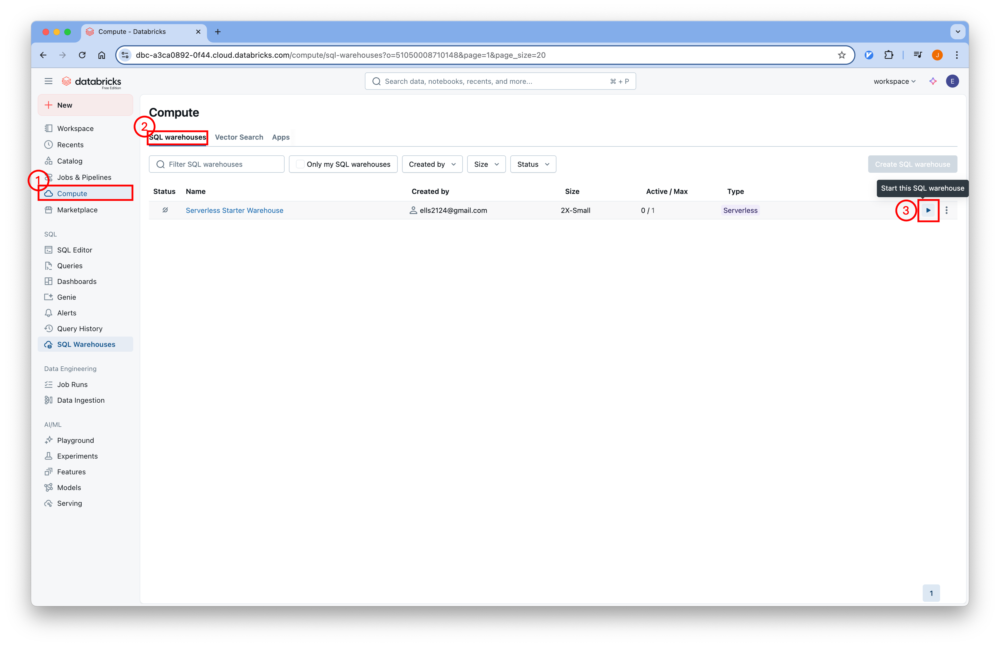
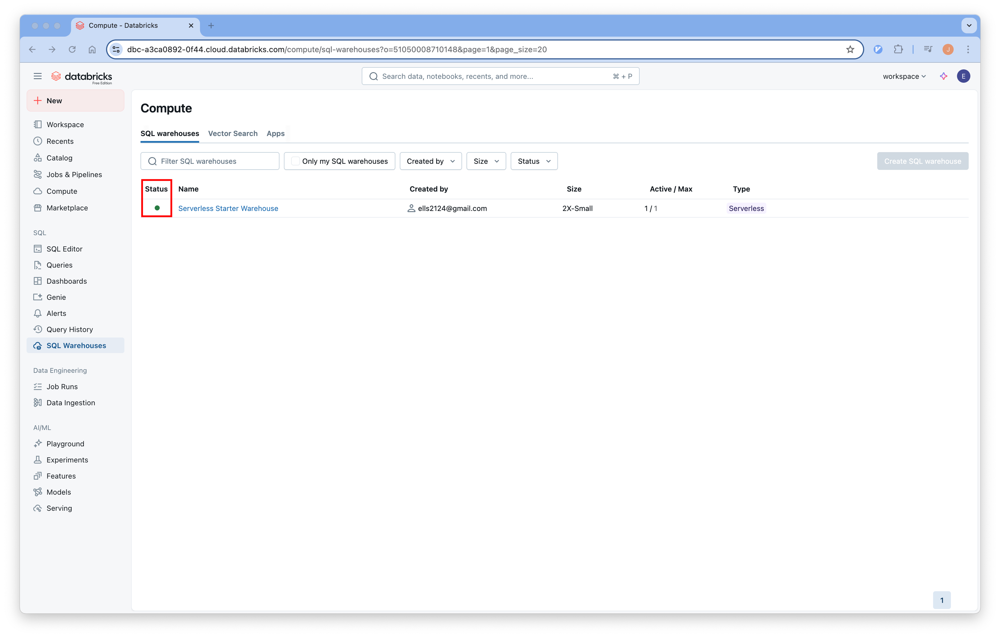
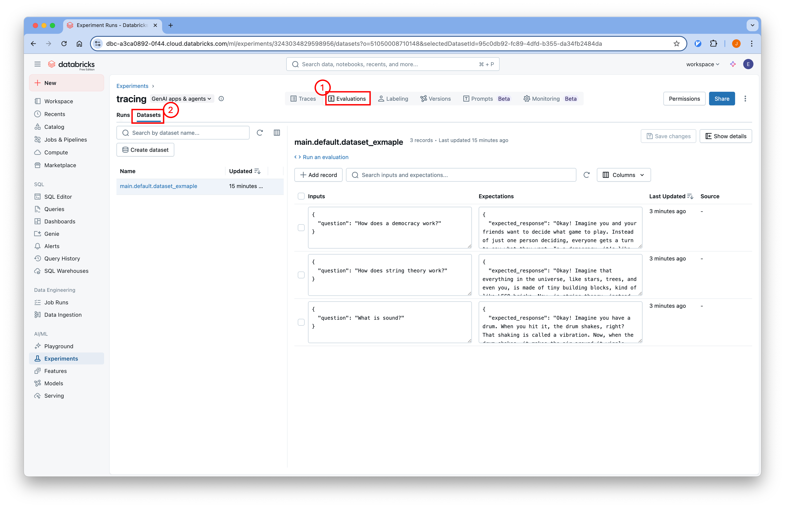
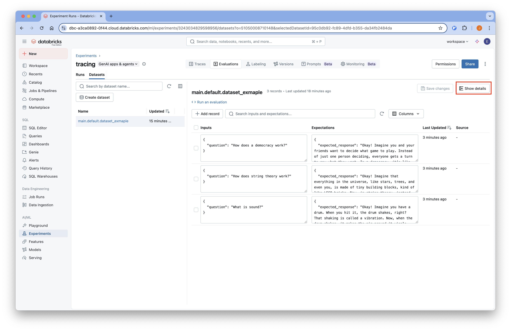
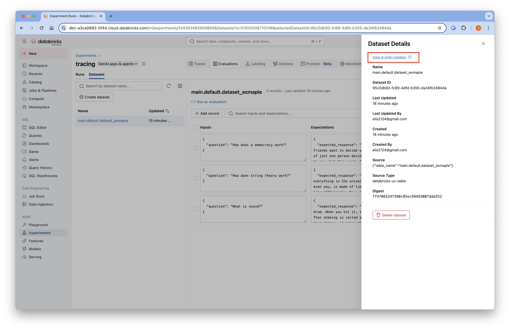
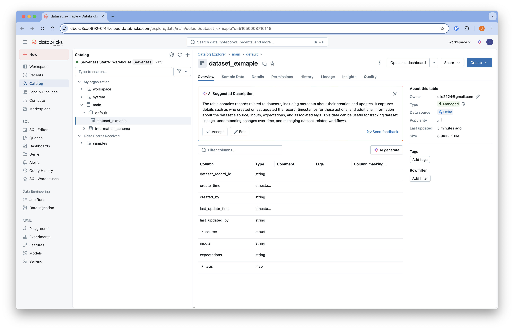
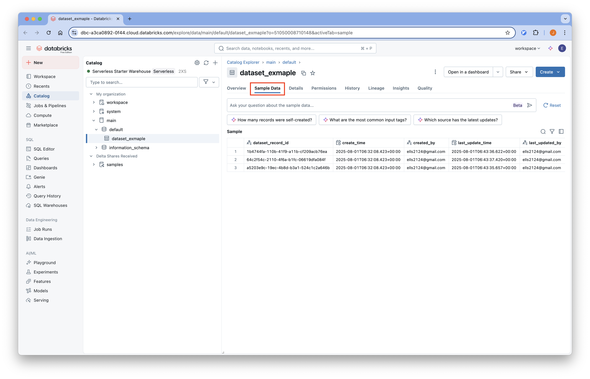

# 04-Dataset

## 개요
Databricks에서 제공하는 Managed MLflow를 사용하여 LangChain 애플리케이션의 데이터셋을 관리하고 평가할 수 있습니다.

튜토리얼에서 사용하는 코드는
[Github](https://github.com/Aiden-Jeon/llm-monitoring/blob/main/notebooks/databricks_mlflow/03_dataset.ipynb)
에서 확인할 수 있습니다.


## Requirements
### Compute 설정
데이터셋을 생성하기 위해서는 데이터를 write 할 수 있는 Compute가 필요합니다.
Databricks Free Edition 에서는 2X-Small 사이즈의 서버리스 컴퓨팅을 제공하고 있습니다.

1. 아래 순서를 통해서 컴퓨팅을 활성화 합니다.
    
2. 활성화 되면 다음과 같이 됩니다.
    

### 환경 변수 설정

프로젝트 루트에 `.env` 파일을 생성하고 필요한 환경 변수를 설정합니다.
:::info
[환경 변수 설정](../tracing/#Environments) 을 참조해 설정합니다.
:::

## Code

### Environments

#### 환경 변수 로드

실행을 위해 필요한 환경 변수를 불러옵니다.

```python
from dotenv import load_dotenv

# 환경 변수 로드
load_dotenv(dotenv_path=".env", override=True)
```

### Dataset 생성 및 관리

#### 1. Dataset 생성

Databricks Unity Catalog를 사용하여 데이터셋을 생성합니다.

```python
import mlflow.genai.datasets

catalog_name = "main"  # replace with your catalog name
schema_name = "default"  # replace with your schema name
dataset_name = "dataset_exmaple"

try:
    # Create a dataset with auto-inferred experiment
    dataset = mlflow.genai.datasets.create_dataset(
        uc_table_name=f"{catalog_name}.{schema_name}.{dataset_name}"
    )
    print("Dataset created successfully:")
except Exception as e:
    if "400" in str(e) or "client error" in str(e).lower():
        print(
            "Dataset creation failed with 400 client error. Trying to get existing dataset..."
        )
        dataset = mlflow.genai.datasets.get_dataset(
            uc_table_name=f"{catalog_name}.{schema_name}.{dataset_name}"
        )
        print("Dataset retrieved successfully:")
    else:
        print(f"Unexpected error: {e}")
        raise
```
:::warning
현재, 데이터셋 생성 API 가 python error 형식이 아닌 request error 형식으로 구성되어 있어 error 처리를 할 때 참고가 필요합니다.

이미 데이터셋이 존재하는 경우 아래와 같은 에러가 출력됩니다.
```python
HTTPError: 400 Client Error: Bad Request
{"error_code":"TABLE_ALREADY_EXISTS","message":"Error [e25eb9b8-d022-4b6f-81be-e8648ef8b022]: TABLE_ALREADY_EXISTS: Failed to create UC table for dataset main.default.dataset_exmaple. TABLE_ALREADY_EXISTS: Table 'main.default.dataset_exmaple' already exists","details":[{"@type":"type.googleapis.com/google.rpc.ErrorInfo","reason":"RESOURCE_ALREADY_EXISTS","domain":"unity-catalog.databricks.com","metadata":{"resourceType":"Table","resourceIdentifier":"main.default.dataset_exmaple"}},{"@type":"type.googleapis.com/google.rpc.RequestInfo","request_id":"e25eb9b8-d022-4b6f-81be-e8648ef8b022","serving_data":""}]}. 
```
:::

### Dataset에 레코드 추가

#### 1. 레코드 데이터 준비

평가용 데이터를 MLflow 형식으로 변환합니다.

```python
records = [
    {
        "input_question": "What is sound?",
        "output_output": "Okay! Imagine you have a drum. When you hit it, the drum shakes, right? That shaking is called a vibration. Now, when the drum shakes, it makes the air around it wiggle too, almost like when you throw a rock in a pond and the water makes little waves. These wiggles in the air are what we call sound! So, sound is like little invisible wiggles in the air that our ears can feel and hear. Just like how you can hear your friend calling you or your favorite song, those are sounds!",
    },
    {
        "input_question": "How does string theory work?",
        "output_output": "Okay! Imagine that everything in the universe, like stars, trees, and even you, is made of tiny building blocks, kind of like LEGO bricks. Now, in string theory, instead of those building blocks being tiny dots, they are super tiny strings, like the strings on a guitar! These strings can wiggle and vibrate. Picture a guitar playing different notes – when a string vibrates in different ways, it makes different sounds. In the same way, when these tiny strings vibrate differently, they become different things, like particles that make up everything you see around you. So, when the strings wiggle and dance around in space, they interact with each other – sometimes they might hug and combine, and other times they might bounce off each other, just like friends playing together. When we look closely at these strings, they act like the little particles we learn about in science. In short, string theory is like saying that everything is made of tiny, wiggly strings, and how they dance and vibrate tells us all about the world we live in!",
    },
    {
        "input_question": "How does a democracy work?",
        "output_output": "Okay! Imagine you and your friends want to decide what game to play. Instead of just one person deciding, everyone gets a turn to say what they want. In a democracy, it's like that, but for the whole country! Here's how it works: 1. **Everyone Has a Voice**: Just like you and your friends all get to say what game you want, in a democracy, everyone gets to share their opinions. This means that everyone gets to vote on important things. 2. **Voting**: When it's time to make a decision, like picking a leader or a new law, everyone votes. Voting is like marking your favorite game on a piece of paper. The choice with the most votes wins! 3. **Leaders**: The people who get the most votes (like class leaders) are called leaders too! They help make the rules and decisions for everyone. 4. **Fairness**: Everyone is treated equally, so whether you're big or small, everyone's voice is important! 5. **Change is Possible**: If people don't like something, they can vote again later or even choose new leaders. It's like changing the game if everyone wants to play something different. So, in a democracy, people work together to decide what's best for everyone by talking, voting, and making sure everyone can be heard!",
    },
]

# Convert to Mlflow format
examples = []
for row in records:
    examples.append(
        {
            "inputs": {"question": row["input_question"]},
            "expectations": {"expected_response": row["output_output"]},
        }
    )
```

#### 2. Dataset에 레코드 병합

```python
dataset = dataset.merge_records(examples)
```
:::warning
만약 비정상적으로 오래 실행이 안된다면 compute 서버가 중단 되었을 가능성이 높습니다.
위의 [requirements](#compute-설정) 를 참조해 compute 서버를 실행합니다.
:::

### Dataset 확인

```python
import mlflow.genai.datasets

# Load existing dataset
dataset = mlflow.genai.datasets.get_dataset(
    uc_table_name=f"{catalog_name}.{schema_name}.{dataset_name}"
)

# Access dataset properties
print(f"Dataset ID: {dataset.dataset_id}")
print(f"Created by: {dataset.created_by}")
print(f"Last updated: {dataset.last_update_time}")
```

## Databricks UI에서 Dataset 확인

1. Databricks Workspace에 접속합니다.
2. 왼쪽 사이드바에서 "Experiments" 탭을 클릭합니다.
3. 생성한 experiment에 들어가서 상단의 "Datasets" 탭을 선택하면 업로드된 데이터셋을 확인할 수 있습니다.
    
4. Show details 버튼을 눌러 생성된 데이터셋의 상세 정보를 확인할 수 있습니다.
    
5. 저장된 데이터셋은 unity catalog 에서도 확인할 수 있습니다.
    
6. 저장된 데이터셋은 스키마 정보를 확인할 수 있습니다.
    
6. sample dataset 탭을 클릭하면 적재된 데이터들의 샘플을 볼 수 있습니다.
    
