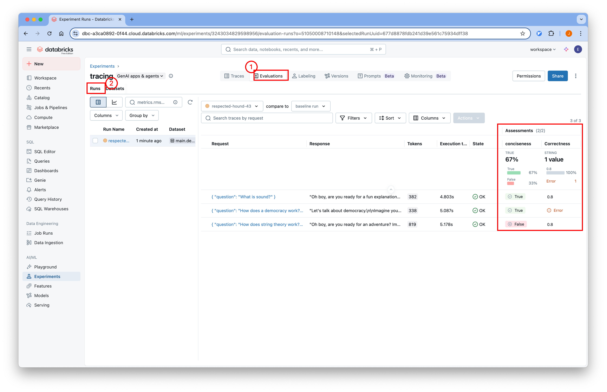
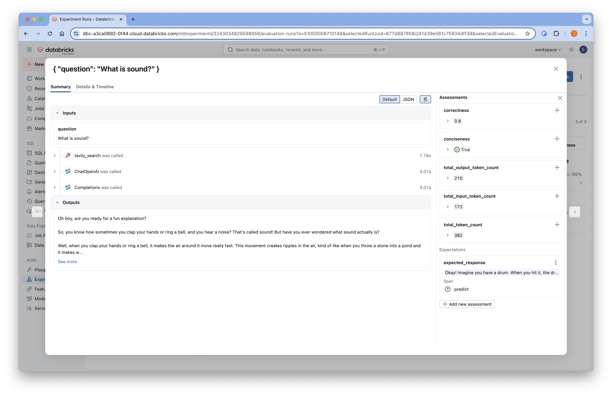

# 05-Evaluation

## 개요
Databricks에서 제공하는 Managed MLflow를 사용하여 LangChain 애플리케이션의 성능을 평가할 수 있습니다.

튜토리얼에서 사용하는 코드는
[Github](https://github.com/Aiden-Jeon/llm-monitoring/blob/main/notebooks/databricks_mlflow/04_evaluation.ipynb)
에서 확인할 수 있습니다.

## Requirements

1. dataset 기능을 사용하기 위해서는 compute 가 활성화 되어 있어야 합니다.  
    :::info
    [compute 설정](../dataset/#compute-설정) 을 참조해 활성화합니다.
    :::

2. 프로젝트 루트에 `.env` 파일을 생성하고 필요한 환경 변수를 설정합니다.
    :::info
    [환경 변수 설정](../tracing/#Environments) 을 참조해 설정합니다.
    :::

## Code

### Environments

실행을 위해 필요한 환경 변수를 불러옵니다.

```python
from dotenv import load_dotenv

# 환경 변수 로드
load_dotenv(dotenv_path=".env", override=True)
```

### Define App Workflow

앞선 tracing 에서 사용한 app 을 정의합니다.
```python
import os
from typing import List
from typing_extensions import TypedDict

from langchain.schema import Document
from langgraph.graph import StateGraph, START, END
from langchain_core.messages import HumanMessage
from langchain_openai import ChatOpenAI
from langchain_tavily import TavilySearch


# 환경 변수에서 설정 가져오기
model_name = os.environ["MODEL_NAME"]
openai_api_key = os.environ["OPENAI_API_KEY"]
openai_api_base = os.environ["OPENAI_API_BASE"]

# LLM 모델 초기화
llm = ChatOpenAI(
    model_name=model_name,
    openai_api_key=openai_api_key,
    openai_api_base=openai_api_base,
)

# Tavily 검색 도구 설정 (최대 1개 결과)
web_search_tool = TavilySearch(max_results=1)

prompt = """You are a professor and expert in explaining complex topics in a way that is easy to understand. 
Your job is to answer the provided question so that even a 5 year old can understand it. 
You have provided with relevant background context to answer the question.

Question: {question} 

Context: {context}

Answer:"""


class GraphState(TypedDict):
    """
    그래프의 상태를 나타냅니다.
    """

    question: str
    documents: List[str]
    messages: List[str]


def search(state):
    """
    질문을 기반으로 웹 검색을 수행합니다.

    Args:
        state (dict): 현재 그래프 상태

    Returns:
        state (dict): 웹 검색 결과가 추가된 documents 키로 업데이트된 상태
    """
    question = state["question"]
    documents = state.get("documents", [])

    # 웹 검색 수행
    web_docs = web_search_tool.invoke({"query": question})
    web_results = "\n".join([d["content"] for d in web_docs["results"]])
    web_results = Document(page_content=web_results)
    documents.append(web_results)

    return {"documents": documents, "question": question}


def explain(state: GraphState):
    """
    컨텍스트를 기반으로 응답을 생성합니다.

    Args:
        state (dict): 현재 그래프 상태

    Returns:
        state (dict): LLM 생성 결과가 포함된 messages 키가 추가된 상태
    """
    question = state["question"]
    documents = state.get("documents", [])
    formatted = prompt.format(
        question=question, context="\n".join([d.page_content for d in documents])
    )
    generation = llm.invoke([HumanMessage(content=formatted)])
    return {"question": question, "messages": [generation]}


# 상태 그래프 생성
graph = StateGraph(GraphState)

# 노드 추가
graph.add_node("explain", explain)
graph.add_node("search", search)

# 엣지 추가
graph.add_edge(START, "search")
graph.add_edge("search", "explain")
graph.add_edge("explain", END)

# 그래프 컴파일
app = graph.compile()
```

### Evaluators 정의

#### 코드 기반 스코어러

결정적이거나 폐쇄형 메트릭을 측정하기 위한 코드 기반 스코어러를 정의합니다.

```python
from mlflow.genai.scorers import scorer
from mlflow.entities import Feedback

@scorer
def conciseness(outputs) -> Feedback:
    words = outputs.split(" ")
    if len(words) <= 200:
        return Feedback(
            value=True,
            rationale="Response is concise."
        )
    else:
        return Feedback(
            value=False,
            rationale="Response is too long."
        )
```

이 특정 커스텀 코드 평가자는 애플리케이션이 200단어 이하의 출력을 생성하는지 확인하는 간단한 Python 함수입니다.

#### 프롬프트 기반 판단

개방형 메트릭의 경우, LLM을 사용하여 출력을 평가하는 것이 강력할 수 있습니다.

```python
from mlflow.genai.judges import custom_prompt_judge
from mlflow.genai.scorers import scorer
import mlflow

correctness_rubric = custom_prompt_judge(
    name="correctness",
    prompt_template="""
You are an expert data labeler evaluating model outputs for correctness. Your task is to assign a score based on the following rubric:

<Instructions>
    - Carefully read the input and output
    - Use the reference output to determine if the model output contains errors
    - Focus whether the model output uses accurate analogies and is logically consistent
</Instructions>

<Reminder>
    The analogies in the output do not need to match the reference output exactly. Focus on logical consistency.
</Reminder>

<input>
    {{input}}
</input>

<output>
    {{output}}
</output>

Use the reference outputs below to help you evaluate the correctness of the response:
<expected_response>
    {{expected_response}}
</expected_response>

<Rubric>
[[comprehensive]]: Identifies all issues, including edge cases, security concerns, and performance implications, and suggests specific improvements with examples.
[[thorough]]: Catches major issues and most minor ones, provides good suggestions but may miss some edge cases.
[[adequate]]: Identifies obvious issues and provides basic feedback, but misses subtle problems.
[[superficial]]: Only catches surface-level issues, feedback is vague or generic.
[[inadequate]]: Misses critical issues or provides incorrect feedback.
</Rubric>

""",
    numeric_values={
        "comprehensive": 1.0,
        "thorough": 0.8,
        "adequate": 0.6,
        "superficial": 0.3,
        "inadequate": 0.0,
    },
)


@scorer
def correctness(inputs, outputs, expectations):
    return correctness_rubric(
        input=inputs["question"],
        output=outputs,
        expected_response=expectations["expected_response"],
    )
```

### Evaluation

#### 1. 평가 데이터셋 정의

기존 데이터셋을 로드합니다.

```python
import mlflow.genai.datasets

catalog_name = "main"  # replace with your catalog name
schema_name = "default"  # replace with your schema name
dataset_name = "dataset_exmaple"

# Load existing dataset
dataset = mlflow.genai.datasets.get_dataset(
    uc_table_name=f"{catalog_name}.{schema_name}.{dataset_name}"
)
```

#### 2. 예측 함수 정의

평가 데이터셋의 모든 행에 대해 호출될 예측 함수를 정의합니다.

```python
# predict_fn will be called for every row in your evaluation
# dataset. Replace with your app's prediction function.  
# NOTE: The **kwargs to predict_fn are the same as the keys of 
# the `inputs` in your dataset. 
def predict(question):
  response = app.invoke({"question": question})
  return response["messages"][0].content
```

#### 3. 평가 실행

평가를 실행합니다.

```python
import mlflow

# Run evaluation
results = mlflow.genai.evaluate(
    data=dataset,
    predict_fn=predict,
    scorers=[conciseness, correctness]
)
```

평가가 완료되면 다음과 같은 정보를 확인할 수 있습니다.
```python
results.tables["eval_results"]
```


## Databricks UI에서 Evaluation 확인

1. Databricks Workspace에 접속합니다.
2. 왼쪽 사이드바에서 "Experiments" 탭을 클릭합니다.
3. 생성한 experiment에 들어가서 상단의 "Evaluations" 탭을 선택하면 평가 결과를 확인할 수 있습니다.
4. Evaluations 탭의 Runs 에서 평가된 결과들을 확인할 수 있습니다.
    
5. 각 request 를 클릭하면 상세 내용을 확인할 수 있습니다.
    
