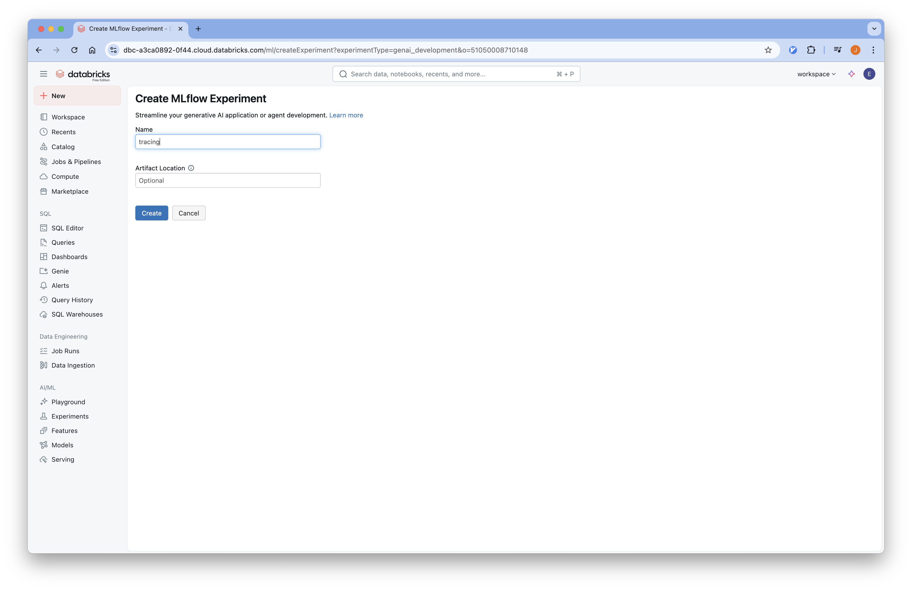
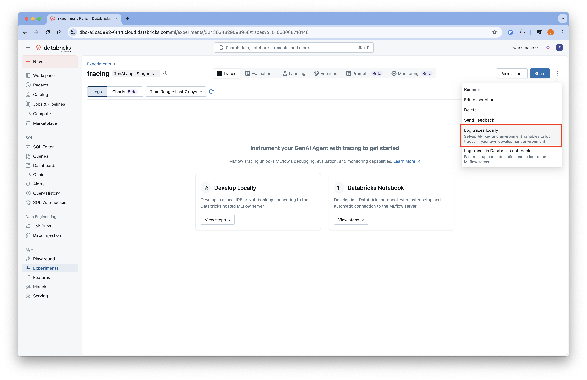
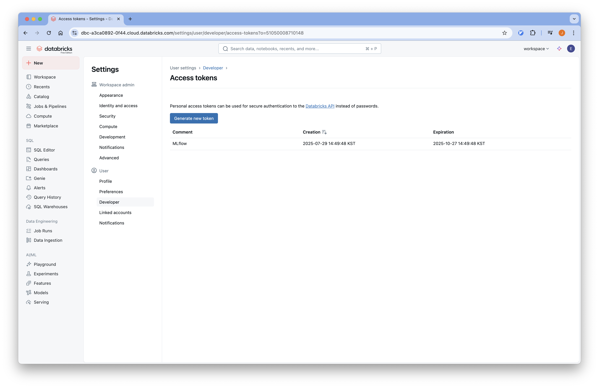

# 01-Installation

Managed mlflow 는 여러 서비스에서 사용할 수 있습니다.
[공식 문서](https://mlflow.org/docs/latest/genai/#running-anywhere)에 언급된 managed 서비스를 제공하는 회사는 다음과 같습니다.
- [Databricks](https://docs.databricks.com/aws/en/mlflow3/genai/)
- [Amazon Sagemaker](https://aws.amazon.com/ko/sagemaker-ai/experiments/)
- [Azure Machine Learning](https://learn.microsoft.com/en-us/azure/machine-learning/concept-mlflow?view=azureml-api-2)
- [Nebius](https://nebius.com/services/managed-mlflow)
- Kubernetes

이번 튜토리얼에서는 Databricks Free Edition 에서 제공하는 Managed Mlflow 를 사용합니다.

## Databricks Mlflow

### Step 1: Free edition
Free Edition 가입을 위해 [https://www.databricks.com/learn/free-edition](https://www.databricks.com/learn/free-edition) 으로 이동합니다.


### Step 2: Sign Up
이메일을 이용해 손쉽게 가입할 수 있습니다.


### Step 3: Databricks Workspace
데이터브릭스에 접속하면 다음과 같은 화면이 나옵니다.


## Experiment 설정

1. Databricks Workspace에 접속합니다.
2. 왼쪽 사이드바에서 "Experiments" 탭을 클릭합니다.
3. GenAI apps & agents 을 선택합니다.
    
4. 이름을 입력하고 experiement 를 생성합니다.
    
5. 다음과 같이 llm 에서 사용하는 기능들이 활성화됩니다.
    

## API Key 발급

데이터브릭스에 로깅을 하기 위한환경 변수들을 생성합니다.

1. Develop Locally 의 View steps 를 선택합니다.
    
2. Generate API Key 버튼을 눌러 API 키를 발급합니다.
    
3. 발급된 environments 를 복사합니다.
    


## Appendix
### Log trace locally
이미 Logging 이 되어서 처음 화면이 뜨지 않는 경우 다음과 같이 환경변수를 생성할 수 있습니다.


### DATABRICKS HOST
Databricks host 는 다음과 같은 규칙으로 설정됩니다.
```plaintext
https://<UNIQUE_ID>.cloud.databricks.com
```
예를 들어서 제가 생성한 workspace 의 URL 은 다음과 같습니다.
- https://dbc-a3ca0892-0f44.cloud.databricks.com/

### DATABRICKS TOKEN
발급된 토큰을 확인하거나 토큰을 새로 발급하기 위해선 다음과 같이 확인할 수 있습니다.

1. 오른쪽 프로필 아이콘을 클릭해 Settings 로 진입합니다.
2. User > Developer > Access tokens 의 Manage 를 클릭합니다.
3. Generate new token 을 눌러서 새로운 API Key 를 발급 받고 저장합니다.
4. 해당 Token 는 이후 `DATABRICKS_TOKEN` 환경 변수에서 사용됩니다.

