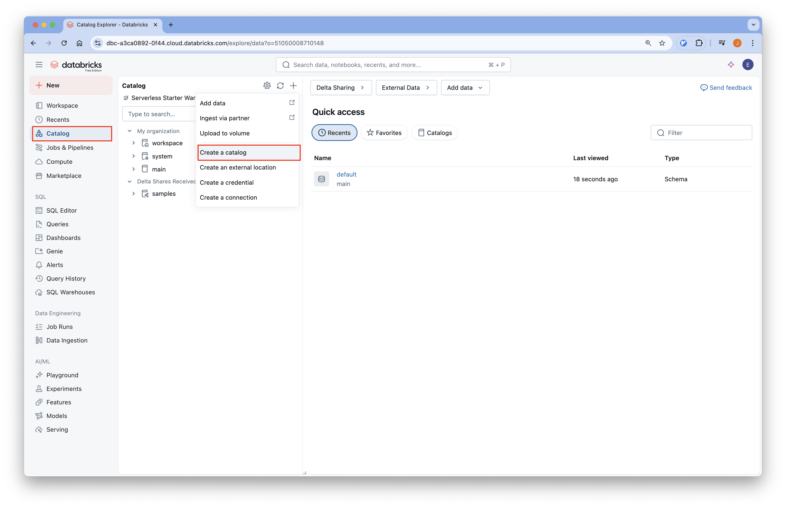
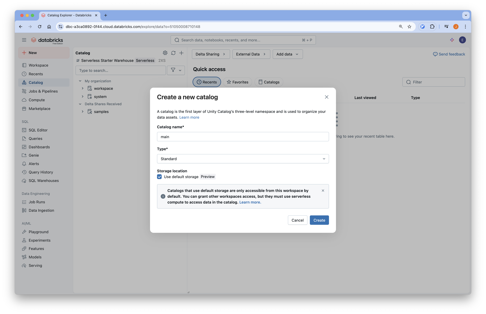
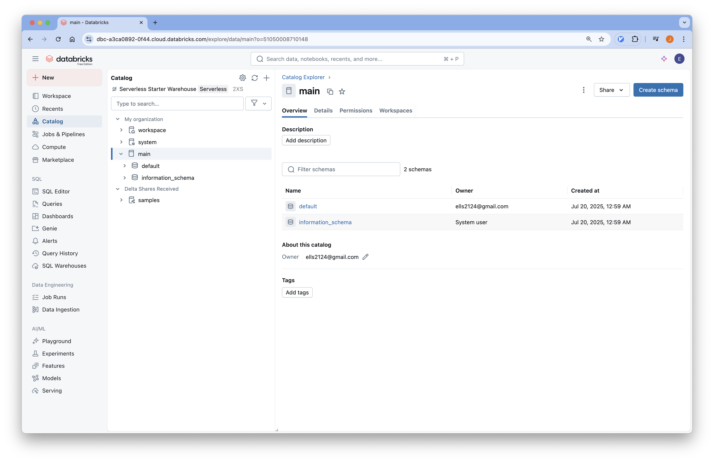
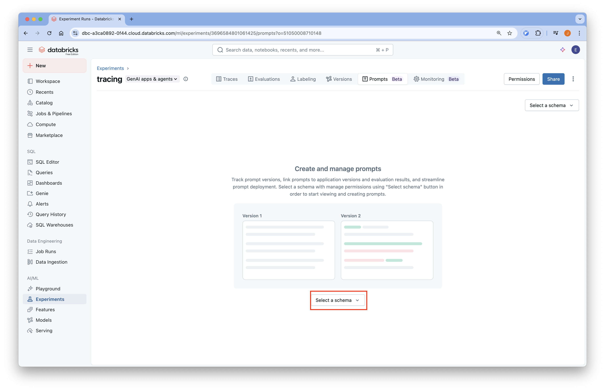
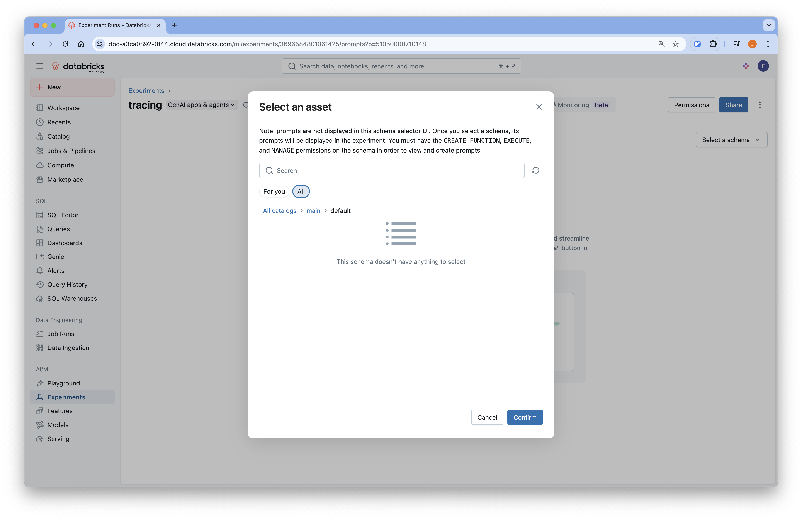
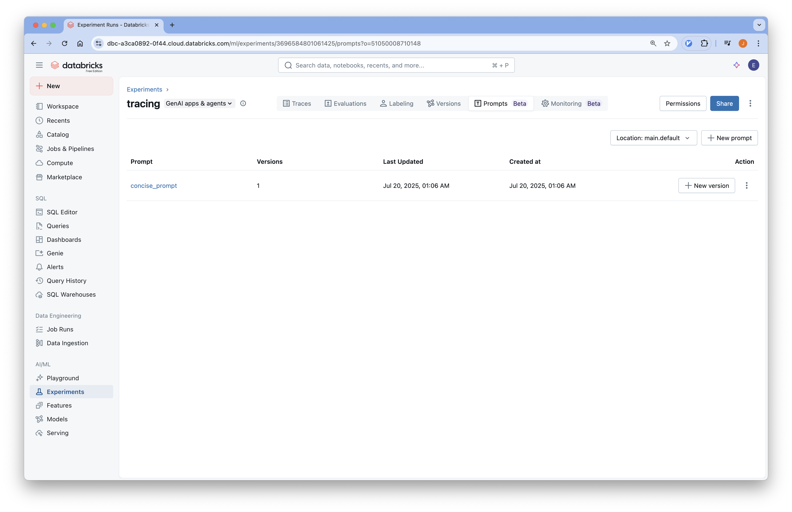

# 03-Prompt Registry

## 개요

Databricks에서 제공하는 Managed MLflow를 사용하여 프롬프트를 버전 관리하고 등록하는 방법에 대해 설명합니다.

Databricks MLflow의 Prompt Registry 기능을 사용하여 프롬프트를 중앙에서 관리하고 버전을 추적할 수 있습니다. Databricks Unity Catalog와 통합되어 있어 엔터프라이즈급 프롬프트 관리가 가능합니다.


튜토리얼에서 사용하는 코드는
[Github](https://github.com/Aiden-Jeon/llm-monitoring/blob/main/notebooks/databricks_mlflow/02_prompt.ipynb)
에서 확인할 수 있습니다.

## Requirements
### Unity Catalog 설정

Databricks 에서 Prompt Registry 를 사용하기 위해서는 Unity Catalog 를 설정해야 합니다.
1. Catalog 탭에서 + 버튼을 누른 후 Create a catalog 버튼을 선택합니다.
    
2. Catalog 이름을 입력합니다 튜토리얼에서는 main 을 사용합니다.
    
3. 다음과 같이 생성된 카탈로그를 확인할 수 있습니다.
    

### 환경 변수 설정

프로젝트 루트에 `.env` 파일을 생성하고 필요한 환경 변수를 설정합니다.
:::info
[환경 변수 설정](../tracing/#Environments) 을 참조해 설정합니다.
:::

## Code

### Environments

#### 1. 환경 변수 로드

실행을 위해 필요한 환경 변수를 불러옵니다.

```python
from dotenv import load_dotenv

# 환경 변수 로드
load_dotenv(dotenv_path=".env", override=True)
```

#### 2. MLflow 설정

Databricks 환경에서는 별도의 추적 서버 설정 없이 자동 로깅만 활성화하면 됩니다.

```python
import mlflow

# LangChain 자동 로깅 활성화
mlflow.langchain.autolog()
```

#### 3. LLM 모델 설정

```python
import os
from langchain_openai import ChatOpenAI

# 환경 변수에서 설정 가져오기
model_name = os.environ["MODEL_NAME"]
openai_api_key = os.environ["OPENAI_API_KEY"]
openai_api_base = os.environ["OPENAI_API_BASE"]

# LLM 모델 초기화
llm = ChatOpenAI(
    model_name=model_name,
    openai_api_key=openai_api_key,
    openai_api_base=openai_api_base,
)
```

#### 4. Tavily 검색 도구

웹 검색을 위한 Tavily 도구를 설정합니다:

```python
from langchain_tavily import TavilySearch

# Tavily 검색 도구 설정 (최대 1개 결과)
web_search_tool = TavilySearch(max_results=1)
```

:::info
  Tavily API 키는 [Tavily Key 발급](../../prerequisitres/tavily/index.md)를 참고해 발급 받을 수 있습니다.
:::
### Prompt Registry

#### 1. 프롬프트 템플릿 정의

RAG(Retrieval-Augmented Generation) 애플리케이션을 위한 프롬프트를 정의합니다:

```python
# Define the prompt template
plain_prompt_template = """
You are an expert at explaining complex topics in simple terms that a 5-year-old could understand. 

Your task is to take a complex question and context information, then provide a clear, simple explanation using:
- Simple words and concepts
- Analogies and examples from everyday life
- Short sentences
- Engaging and friendly tone

Keep your explanation concise but complete.

Question: {question}

Context: {context}

Please explain this in simple terms that a 5-year-old would understand:
"""
```

#### 2. MLflow에 프롬프트 등록

Databricks Mlflow 에서는 프롬프트를 등록하기 위해서 catalog 와 schema 이름을 지정해야 합니다.
```python
import mlflow

catalog_name = "main"  # replace with your catalog name
schema_name = "default"  # replace with your schema name
system_prompt = mlflow.genai.register_prompt(
    name=f"{catalog_name}.{schema_name}.concise_prompt",
    template=plain_prompt_template,
    # commit_message="Initial version of prompt",
)
mlflow.genai.set_prompt_alias(
    f"{catalog_name}.{schema_name}.concise_prompt",
    alias="production",
    version=system_prompt.version,
)
```

#### 3. MLflow에서 프롬프트 로드
Databricks 에서 prompt 를 불러올 때는 version 혹은 alias 를 사용해 불러옵니다.
오픈소스 MLflow 와 다르게 catalog.schmea 를 주어야 합니다.

- Version 으로 불러오는 경우 `/` 와 특정 버전을 명시해 불러올 수 있습니다.
    ```
    prompts:/{catalog_name}.{schema_name}.{prompt_name}/{version}
    ```
- Alias 로 불러오는 경우 `@` 와 alias 이름을 명시해 불러올 수 있습니다.
    ```
    prompts:/{catalog_name}.{schema_name}.{prompt_name}@{alias_name}
    ```

```python
from langchain_core.prompts import ChatPromptTemplate

# Create LangChain prompt object
mlflow_prompt = mlflow.genai.load_prompt(
    f"prompts:/{catalog_name}.{schema_name}.concise_prompt@production"
)

langchain_prompt = ChatPromptTemplate.from_messages(
    [
        (
            # IMPORTANT: Convert prompt template from double to single curly braces format
            "system",
            mlflow_prompt.to_single_brace_format(),
        ),
    ]
)
```


## Databricks UI에서 Prompt 확인

1. Prompts 로 가서 앞서 생성한 catalog 와 schema 를 지정해줍니다.
    
    
2. 등록된 prompt 들을 볼 수 있습니다.
    
3. 각 프롬프트의 버전과 별칭을 확인할 수 있습니다.
    


## Prompt Test
불러온 프롬프트가 정상적으로 수행되는 지 확인합니다.

### LangGraph 애플리케이션 구성

#### Graph State

```python
from langchain.schema import Document
from typing import List
from typing_extensions import TypedDict

class GraphState(TypedDict):
    """
    그래프의 상태를 나타냅니다.
    """
    question: str
    documents: List[str]
    messages: List[str]
```

#### Search Node

```python
from langchain_core.messages import HumanMessage

def search(state):
    """
    질문을 기반으로 웹 검색을 수행합니다.

    Args:
        state (dict): 현재 그래프 상태

    Returns:
        state (dict): 웹 검색 결과가 추가된 documents 키로 업데이트된 상태
    """
    question = state["question"]
    documents = state.get("documents", [])

    # 웹 검색 수행
    web_docs = web_search_tool.invoke({"query": question})
    web_results = "\n".join([d["content"] for d in web_docs["results"]])
    web_results = Document(page_content=web_results)
    documents.append(web_results)

    return {"documents": documents, "question": question}
```

#### Explain Node

```python
def explain(state: GraphState):
    """
    컨텍스트를 기반으로 응답을 생성합니다.
    
    Args:
        state (dict): 현재 그래프 상태
        
    Returns:
        state (dict): LLM 생성 결과가 포함된 messages 키가 추가된 상태
    """
    question = state["question"]
    documents = state.get("documents", [])
    formatted = langchain_prompt.format(
        question=question, 
        context="\n".join([d.page_content for d in documents])
    )
    generation = llm.invoke([HumanMessage(content=formatted)])
    return {"question": question, "messages": [generation]}
```

#### Compile Graph

```python
from langgraph.graph import StateGraph, START, END

# 상태 그래프 생성
graph = StateGraph(GraphState)

# 노드 추가
graph.add_node("explain", explain)
graph.add_node("search", search)

# 엣지 추가
graph.add_edge(START, "search")
graph.add_edge("search", "explain")
graph.add_edge("explain", END)

# 그래프 컴파일
app = graph.compile()
```

#### (Optional) Visualize Graph

```python
from IPython.display import Image, display

display(Image(app.get_graph().draw_mermaid_png()))
```

### Graph Test

```python
# 질문 정의
question = "What is complexity economics?"

# 애플리케이션 실행
response = app.invoke({"question": question})

# 응답 출력
print(response["messages"][0].content)
```
