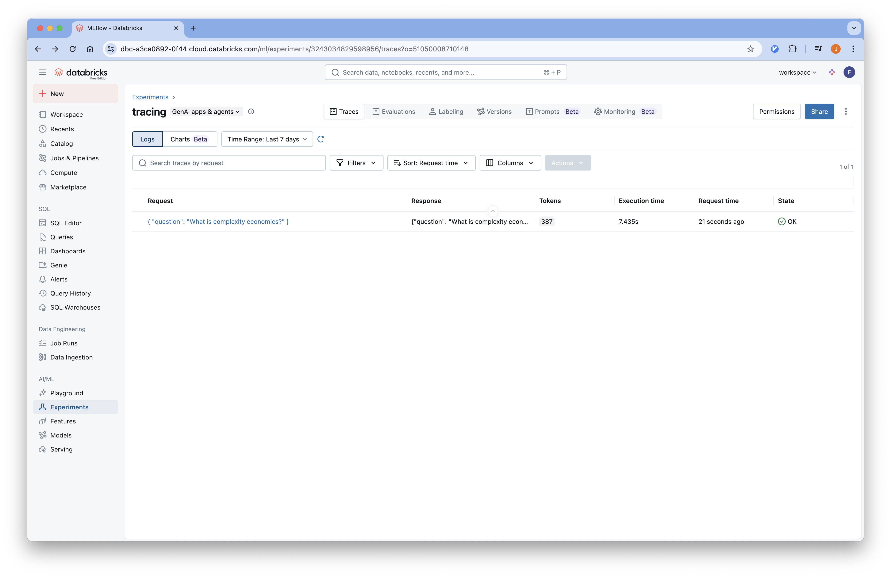
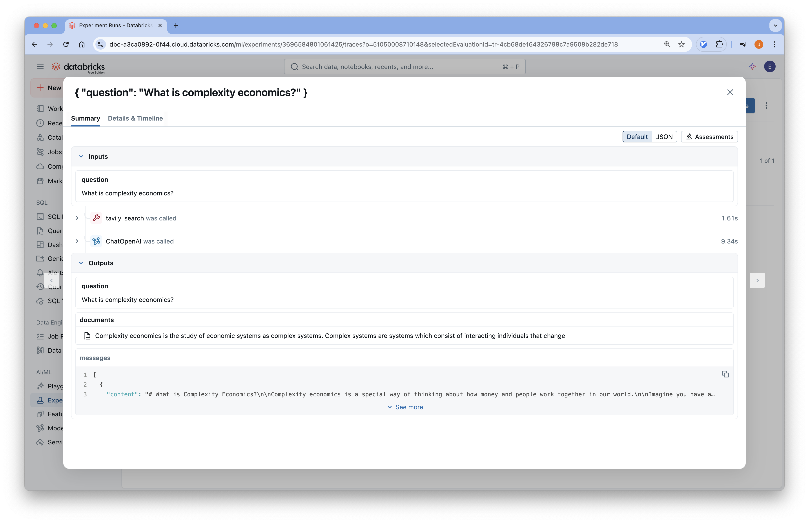

# 02-Tracing

## 개요
Databricks에서 제공하는 Managed MLflow를 사용하여 LangChain 애플리케이션의 실행 과정을 추적하고 모니터링 할 수 있습니다.

튜토리얼에서 사용하는 코드는
[Github](https://github.com/Aiden-Jeon/llm-monitoring/blob/main/notebooks/databricks_mlflow/01_tracing.ipynb)
에서 확인할 수 있습니다.


## Requirements

### 환경 변수 설정

프로젝트 루트에 `.env` 파일을 생성하고 필요한 환경 변수를 설정합니다.
환경 변수는 3가지 섹션으로 구성되어 있습니다.

1. Databricks Mlflow 를 사용하기 위한 환경 변수
    :::info
    [Databricks MLflow API Key 발급](../installation/#api-key-발급)를 참고해 해 토큰들을 받습니다..
    :::
2. Tavily를 사용하기 위한 환경 변수
    :::info
    Tavily API 키는 [Tavily Key 발급](../../prerequisitres/tavily/index.md)를 참고해 발급 받을 수 있습니다.
    :::
3. LLM을 사용하기 위한 환경 변수


```bash
# DATABRICKS MLFLOW
DATABRICKS_TOKEN=<redacted>
DATABRICKS_HOST=https://<UNIQUE_ID>.cloud.databricks.com
MLFLOW_TRACKING_URI=databricks
MLFLOW_REGISTRY_URI=databricks-uc
MLFLOW_EXPERIMENT_ID=<redacted>

# LLM
MODEL_NAME=gpt-3.5-turbo
OPENAI_API_KEY=your_openai_api_key
OPENAI_API_BASE=https://api.openai.com/v1

# TAVILY
TAVILY_API_KEY=your_tavily_api_key
```

## Code

### Environments

#### 1. 환경 변수 로드

실행을 위해 필요한 환경 변수를 불러옵니다.

```python
from dotenv import load_dotenv

# 환경 변수 로드
load_dotenv(dotenv_path=".env", override=True)
```

#### 2. MLflow 설정

Databricks 환경에서는 별도의 추적 서버 설정 없이 자동 로깅만 활성화하면 됩니다.

```python
import mlflow

# LangChain 자동 로깅 활성화
mlflow.langchain.autolog()
```

#### 3. LLM 모델 설정

```python
import os
from langchain_openai import ChatOpenAI

# 환경 변수에서 설정 가져오기
model_name = os.environ["MODEL_NAME"]
openai_api_key = os.environ["OPENAI_API_KEY"]
openai_api_base = os.environ["OPENAI_API_BASE"]

# LLM 모델 초기화
llm = ChatOpenAI(
    model_name=model_name,
    openai_api_key=openai_api_key,
    openai_api_base=openai_api_base,
)
```

#### 4. Tavily 검색 도구

웹 검색을 위한 Tavily 도구를 설정합니다:

```python
from langchain_tavily import TavilySearch

# Tavily 검색 도구 설정 (최대 1개 결과)
web_search_tool = TavilySearch(max_results=1)
```

### LangGraph 애플리케이션 구성

#### Prompt

RAG(Retrieval-Augmented Generation) 애플리케이션을 위한 프롬프트를 정의합니다.

```python
prompt = """You are a professor and expert in explaining complex topics in a way that is easy to understand. 
Your job is to answer the provided question so that even a 5 year old can understand it. 
You have provided with relevant background context to answer the question.

Question: {question} 

Context: {context}

Answer:"""
print("Prompt Template: ", prompt)
```

#### Graph State

```python
from langchain.schema import Document
from typing import List
from typing_extensions import TypedDict

class GraphState(TypedDict):
    """
    그래프의 상태를 나타냅니다.
    """
    question: str
    documents: List[str]
    messages: List[str]
```

#### Search Node

```python
from langchain_core.messages import HumanMessage

def search(state):
    """
    질문을 기반으로 웹 검색을 수행합니다.

    Args:
        state (dict): 현재 그래프 상태

    Returns:
        state (dict): 웹 검색 결과가 추가된 documents 키로 업데이트된 상태
    """
    question = state["question"]
    documents = state.get("documents", [])

    # 웹 검색 수행
    web_docs = web_search_tool.invoke({"query": question})
    web_results = "\n".join([d["content"] for d in web_docs["results"]])
    web_results = Document(page_content=web_results)
    documents.append(web_results)

    return {"documents": documents, "question": question}
```

#### Explain Node

```python
def explain(state: GraphState):
    """
    컨텍스트를 기반으로 응답을 생성합니다.
    
    Args:
        state (dict): 현재 그래프 상태
        
    Returns:
        state (dict): LLM 생성 결과가 포함된 messages 키가 추가된 상태
    """
    question = state["question"]
    documents = state.get("documents", [])
    formatted = prompt.format(
        question=question, 
        context="\n".join([d.page_content for d in documents])
    )
    generation = llm.invoke([HumanMessage(content=formatted)])
    return {"question": question, "messages": [generation]}
```

#### Compile Graph

```python
from langgraph.graph import StateGraph, START, END

# 상태 그래프 생성
graph = StateGraph(GraphState)

# 노드 추가
graph.add_node("explain", explain)
graph.add_node("search", search)

# 엣지 추가
graph.add_edge(START, "search")
graph.add_edge("search", "explain")
graph.add_edge("explain", END)

# 그래프 컴파일
app = graph.compile()
```

#### (Optional) Visualize Graph

```python
from IPython.display import Image, display

display(Image(app.get_graph().draw_mermaid_png()))
```

### Graph Test

```python
# 질문 정의
question = "What is complexity economics?"

# 애플리케이션 실행
response = app.invoke({"question": question})

# 응답 출력
print(response["messages"][0].content)
```

## Databricks UI에서 Trace 확인

1. Databricks Workspace에 접속합니다.
2. 왼쪽 사이드바에서 "Experiments" 탭을 클릭합니다.
3. 생성한 experiment 에 들어가서 상단의 trace 탭을 선택하면 로깅된 trace 들을 확인할 수 있습니다.
    
4. 실행된 추적을 클릭하여 상세 정보를 확인할 수 있습니다.
    
5. 각 단계별 실행 시간, 입력/출력, 메타데이터 등을 확인할 수 있습니다.
