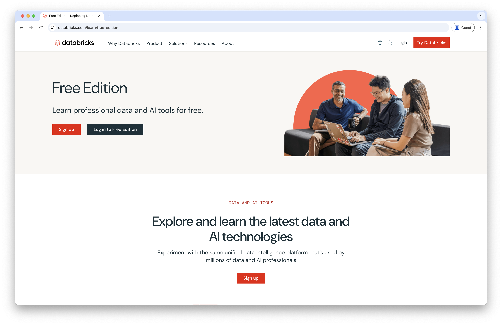
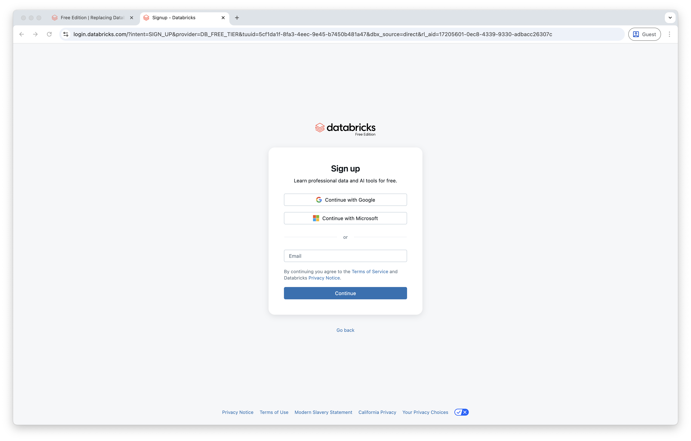
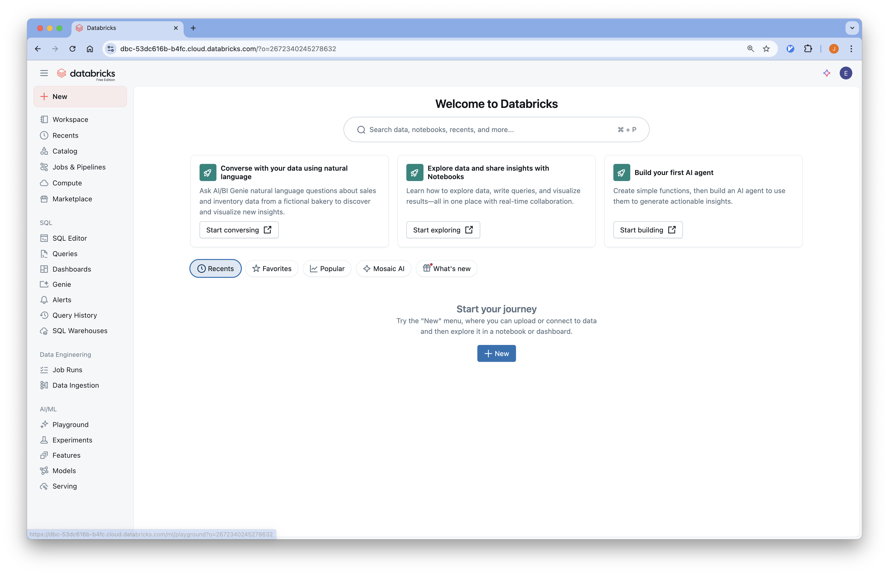
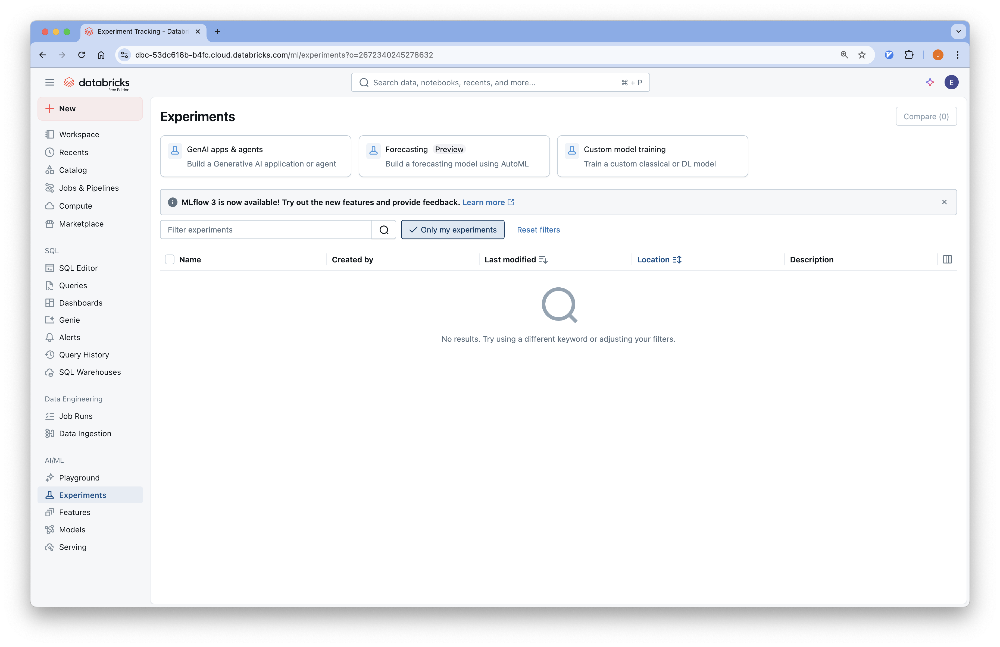

# Managed Mlflow

Managed mlflow 는 여러 서비스에서 사용할 수 있습니다.
[공식 문서](https://mlflow.org/docs/latest/genai/#running-anywhere)에 언급된 managed 서비스를 제공하는 회사는 다음과 같습니다.
- [Databricks](https://docs.databricks.com/aws/en/mlflow3/genai/)
- [Amazon Sagemaker](https://aws.amazon.com/ko/sagemaker-ai/experiments/)
- [Azure Machine Learning](https://learn.microsoft.com/en-us/azure/machine-learning/concept-mlflow?view=azureml-api-2)
- [Nebius](https://nebius.com/services/managed-mlflow)
- Kubernetes

이번 튜토리얼에서는 Databricks Free Edition 에서 제공하는 Managed Mlflow 를 사용합니다.

## Databricks Mlflow

### Step 1: Free edition
Free Edition 가입을 위해 [https://www.databricks.com/learn/free-edition](https://www.databricks.com/learn/free-edition) 으로 이동합니다.

### Step 2: Sign Up
이메일을 이용해 손쉽게 가입할 수 있습니다.

### Step 3: Databricks Workspace
데이터브릭스에 접속하면 다음과 같은 화면이 나옵니다.

### Step 4: Expeirments Tab
화면 왼쪽에서 Experiments 탭을 클릭해 mlflow 를 사용할 수 있습니다.

