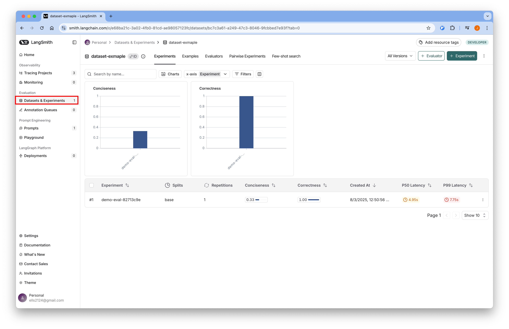
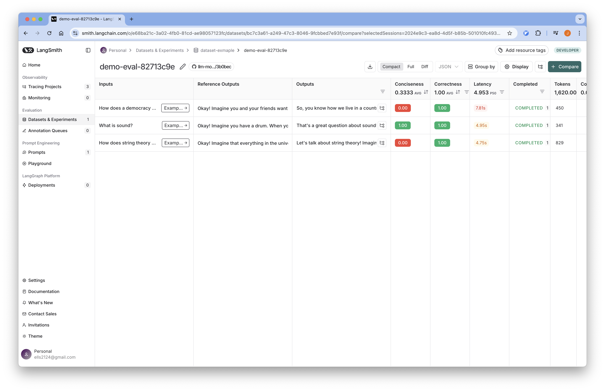

# 04-Evaluation

## 개요
LangSmith를 사용하여 LangChain 애플리케이션의 성능을 평가하고 모니터링할 수 있습니다.
LangSmith는 다양한 평가 방법을 제공하여 애플리케이션의 품질을 측정하고 개선할 수 있는 도구를 제공합니다.

튜토리얼에서 사용하는 코드는
[Github](https://github.com/Aiden-Jeon/llm-monitoring/blob/main/notebooks/langsmith/04_evaluation.ipynb)
에서 확인할 수 있습니다.

## Requirements

### 환경 변수 설정

프로젝트 루트에 `.env` 파일을 생성하고 필요한 환경 변수를 설정합니다.
:::info
[환경 변수 설정](../tracing/#Environments) 을 참조해 설정합니다.
:::

## Code

### Environments

#### 1. 환경 변수 로드

실행을 위해 필요한 환경 변수를 불러옵니다.

```python
from dotenv import load_dotenv

# 환경 변수 로드
load_dotenv(dotenv_path=".env", override=True)
```

#### 2. LLM 모델 설정

LangSmith는 환경 변수를 통해 자동으로 추적이 활성화됩니다.

```python
import os
from langchain_openai import ChatOpenAI

# 환경 변수에서 설정 가져오기
model_name = os.environ["MODEL_NAME"]
openai_api_key = os.environ["OPENAI_API_KEY"]
openai_api_base = os.environ["OPENAI_API_BASE"]

# LLM 모델 초기화
llm = ChatOpenAI(
    model_name=model_name,
    openai_api_key=openai_api_key,
    openai_api_base=openai_api_base,
)
```

#### 3. Tavily 검색 도구

웹 검색을 위한 Tavily 도구를 설정합니다:

```python
from langchain_tavily import TavilySearch

# Tavily 검색 도구 설정 (최대 1개 결과)
web_search_tool = TavilySearch(max_results=1)
```

:::info
  Tavily API 키는 [Tavily Key 발급](../../prerequisitres/tavily/index.md)를 참고해 발급 받을 수 있습니다.
:::

### LangGraph 애플리케이션 구성

#### Prompt

RAG(Retrieval-Augmented Generation) 애플리케이션을 위한 프롬프트를 정의합니다:

```python
prompt = """You are a professor and expert in explaining complex topics in a way that is easy to understand. 
Your job is to answer the provided question so that even a 5 year old can understand it. 
You have provided with relevant background context to answer the question.

Question: {question} 

Context: {context}

Answer:"""
print("Prompt Template: ", prompt)
```

#### Graph State

```python
from langchain.schema import Document
from typing import List
from typing_extensions import TypedDict

class GraphState(TypedDict):
    """
    그래프의 상태를 나타냅니다.
    """
    question: str
    documents: List[str]
    messages: List[str]
```

#### Search Node

```python
from langchain_core.messages import HumanMessage

def search(state):
    """
    질문을 기반으로 웹 검색을 수행합니다.

    Args:
        state (dict): 현재 그래프 상태

    Returns:
        state (dict): 웹 검색 결과가 추가된 documents 키로 업데이트된 상태
    """
    question = state["question"]
    documents = state.get("documents", [])

    # 웹 검색 수행
    web_docs = web_search_tool.invoke({"query": question})
    web_results = "\n".join([d["content"] for d in web_docs["results"]])
    web_results = Document(page_content=web_results)
    documents.append(web_results)

    return {"documents": documents, "question": question}
```

#### Explain Node

```python
def explain(state: GraphState):
    """
    컨텍스트를 기반으로 응답을 생성합니다.
    
    Args:
        state (dict): 현재 그래프 상태
        
    Returns:
        state (dict): LLM 생성 결과가 포함된 messages 키가 추가된 상태
    """
    question = state["question"]
    documents = state.get("documents", [])
    formatted = prompt.format(
        question=question, 
        context="\n".join([d.page_content for d in documents])
    )
    generation = llm.invoke([HumanMessage(content=formatted)])
    return {"question": question, "messages": [generation]}
```

#### Compile Graph

```python
from langgraph.graph import StateGraph, START, END

# 상태 그래프 생성
graph = StateGraph(GraphState)

# 노드 추가
graph.add_node("explain", explain)
graph.add_node("search", search)

# 엣지 추가
graph.add_edge(START, "search")
graph.add_edge("search", "explain")
graph.add_edge("explain", END)

# 그래프 컴파일
app = graph.compile()
```

### 평가자(Evaluators) 정의

#### 1. Custom Code Evaluator

결정적이거나 폐쇄형 메트릭을 측정하기 위한 커스텀 코드 평가자를 정의합니다:

```python
def conciseness(outputs: dict) -> bool:
    words = outputs["output"].split(" ")
    return len(words) <= 200
```

이 평가자는 애플리케이션이 200단어 이하의 응답을 생성하는지 확인합니다.

#### 2. LLM-as-a-Judge Evaluator

개방형 메트릭의 경우, LLM을 사용하여 출력을 평가할 수 있습니다.
먼저 LLM이 따라야 할 점수 체계를 정의합니다:

```python
from pydantic import BaseModel, Field

# LLM이 따라야 할 점수 체계 정의
class CorrectnessScore(BaseModel):
    """참조 답안과 비교했을 때 답안의 정확성 점수."""

    score: int = Field(
        description="답안의 정확성 점수, 0에서 1까지"
    )
```

#### 3. Correctness Evaluator

LLM을 사용하여 애플리케이션의 출력을 평가하는 함수를 정의합니다:

```python
from langchain_openai import ChatOpenAI
from langchain_core.messages import HumanMessage

def correctness(inputs: dict, outputs: dict, reference_outputs: dict) -> bool:
    prompt = """
    You are an expert data labeler evaluating model outputs for correctness. Your task is to assign a score based on the following rubric:

    <Rubric>
        A correct answer:
        - Provides accurate information
        - Uses suitable analogies and examples
        - Contains no factual errors
        - Is logically consistent

        When scoring, you should penalize:
        - Factual errors
        - Incoherent analogies and examples
        - Logical inconsistencies
    </Rubric>

    <Instructions>
        - Carefully read the input and output
        - Use the reference output to determine if the model output contains errors
        - Focus whether the model output uses accurate analogies and is logically consistent
    </Instructions>

    <Reminder>
        The analogies in the output do not need to match the reference output exactly. Focus on logical consistency.
    </Reminder>

    <input>
        {}
    </input>

    <output>
        {}
    </output>

    Use the reference outputs below to help you evaluate the correctness of the response:
    <reference_outputs>
        {}
    </reference_outputs>
    """.format(
        inputs["question"], outputs["output"], reference_outputs["output"]
    )

    structured_llm = ChatOpenAI(
        model_name=model_name,
        openai_api_key=openai_api_key,
        openai_api_base=openai_api_base,
        temperature=0
    ).with_structured_output(CorrectnessScore)
    generation = structured_llm.invoke([HumanMessage(content=prompt)])
    return generation.score == 1
```

### 실행 함수 정의

데이터셋의 예제 입력에 대해 애플리케이션을 실행하는 함수를 정의합니다:

```python
def run(inputs: dict):
    response = app.invoke({"question": inputs["question"]})
    return response["messages"][0].content
```

### 실험 실행

모든 구성 요소가 준비되었으므로 실험을 실행합니다:

```python
from langsmith import evaluate

dataset_name = "dataset-exmaple"
evaluate(
    run,
    data=dataset_name,
    evaluators=[correctness, conciseness],
    experiment_prefix="demo-eval"
)
```

## LangSmith UI에서 평가 결과 확인

1. 브라우저에서 [LangSmith](https://smith.langchain.com/)에 접속합니다.
2. 로그인 후 프로젝트를 선택합니다.
3. Datasets 탭에서 데이터셋을 확인할 수 있습니다.
    
4. 평가 결과를 확인하려면 데이터셋을 클릭하고 Compare 탭을 선택합니다.
    
5. 평가 메트릭과 결과를 상세히 확인할 수 있습니다.
