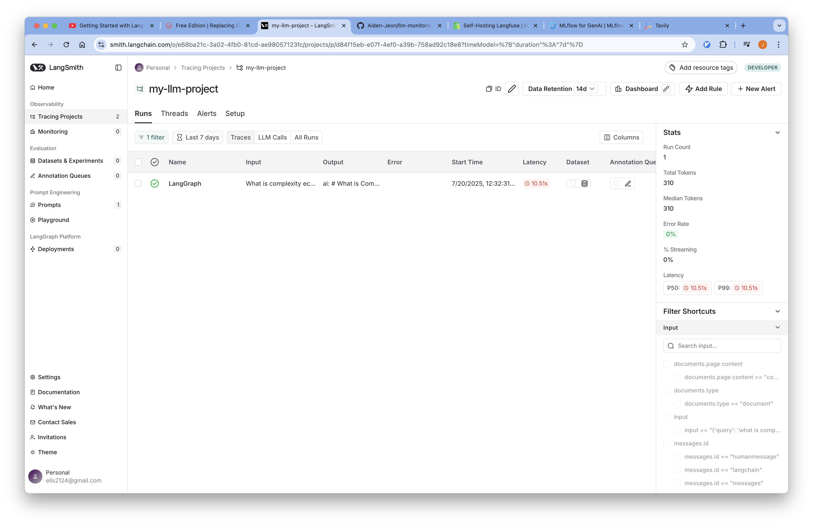
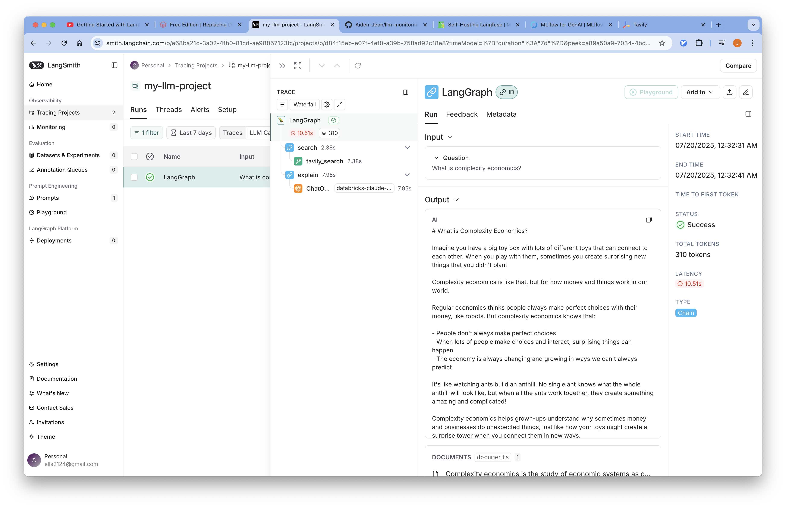

# 02-Tracing

LangSmith를 사용하여 LangChain 애플리케이션의 실행 과정을 추적하고 모니터링할 수 있습니다.

## 개요

LangSmith는 LangChain에서 공식적으로 제공하는 개발자 플랫폼입니다. LangChain 애플리케이션의 실행 과정을 추적하고, 디버깅하며, 성능을 최적화할 수 있는 도구를 제공합니다.

## Requirements

### 1. LangSmith 계정 설정

LangSmith 계정을 생성하여 API 키를 발급받아야 합니다.

:::info
  [LangSmith 설치 가이드](../installation/index.md)를 참고해 LangSmith 계정을 설정합니다.
:::

### 2. 환경 변수 설정

프로젝트 루트에 `.env` 파일을 생성하고 필요한 환경 변수를 설정합니다.
- LangSmith를 사용하기 위한 환경 변수
- LLM을 사용하기 위한 환경 변수
- Tavily를 사용하기 위한 환경 변수

```bash
# LANGSMITH
LANGCHAIN_TRACING_V2="true"
LANGSMITH_ENDPOINT="https://api.smith.langchain.com"
LANGSMITH_API_KEY="<redacted>"
LANGSMITH_PROJECT="my-llm-project"

# LLM
MODEL_NAME=gpt-3.5-turbo
OPENAI_API_KEY=your_openai_api_key
OPENAI_API_BASE=https://api.openai.com/v1

# TAVILY
TAVILY_API_KEY=your_tavily_api_key

```

## Code

### Environments

#### 1. 환경 변수 로드

실행을 위해 필요한 환경 변수를 불러옵니다.

```python
from dotenv import load_dotenv

# 환경 변수 로드
load_dotenv(dotenv_path=".env", override=True)
```

#### 2. LLM 모델 설정

LangSmith는 환경 변수를 통해 자동으로 추적이 활성화됩니다.

```python
import os
from langchain_openai import ChatOpenAI

# 환경 변수에서 설정 가져오기
model_name = os.environ["MODEL_NAME"]
openai_api_key = os.environ["OPENAI_API_KEY"]
openai_api_base = os.environ["OPENAI_API_BASE"]

# LLM 모델 초기화
llm = ChatOpenAI(
    model_name=model_name,
    openai_api_key=openai_api_key,
    openai_api_base=openai_api_base,
)
```

#### 3. Tavily 검색 도구

웹 검색을 위한 Tavily 도구를 설정합니다:

```python
from langchain_tavily import TavilySearch

# Tavily 검색 도구 설정 (최대 1개 결과)
web_search_tool = TavilySearch(max_results=1)
```

:::info
  Tavily API 키는 [Tavily Key 발급](../../prerequisitres/tavily/index.md)를 참고해 발급 받을 수 있습니다.
:::
### LangGraph 애플리케이션 구성

#### Prompt

RAG(Retrieval-Augmented Generation) 애플리케이션을 위한 프롬프트를 정의합니다:

```python
prompt = """You are a professor and expert in explaining complex topics in a way that is easy to understand. 
Your job is to answer the provided question so that even a 5 year old can understand it. 
You have provided with relevant background context to answer the question.

Question: {question} 

Context: {context}

Answer:"""
print("Prompt Template: ", prompt)
```

#### Graph State

```python
from langchain.schema import Document
from typing import List
from typing_extensions import TypedDict

class GraphState(TypedDict):
    """
    그래프의 상태를 나타냅니다.
    """
    question: str
    documents: List[str]
    messages: List[str]
```

#### Search Node

```python
from langchain_core.messages import HumanMessage

def search(state):
    """
    질문을 기반으로 웹 검색을 수행합니다.

    Args:
        state (dict): 현재 그래프 상태

    Returns:
        state (dict): 웹 검색 결과가 추가된 documents 키로 업데이트된 상태
    """
    question = state["question"]
    documents = state.get("documents", [])

    # 웹 검색 수행
    web_docs = web_search_tool.invoke({"query": question})
    web_results = "\n".join([d["content"] for d in web_docs["results"]])
    web_results = Document(page_content=web_results)
    documents.append(web_results)

    return {"documents": documents, "question": question}
```

#### Explain Node

```python
def explain(state: GraphState):
    """
    컨텍스트를 기반으로 응답을 생성합니다.
    
    Args:
        state (dict): 현재 그래프 상태
        
    Returns:
        state (dict): LLM 생성 결과가 포함된 messages 키가 추가된 상태
    """
    question = state["question"]
    documents = state.get("documents", [])
    formatted = prompt.format(
        question=question, 
        context="\n".join([d.page_content for d in documents])
    )
    generation = llm.invoke([HumanMessage(content=formatted)])
    return {"question": question, "messages": [generation]}
```

#### Compile Graph

```python
from langgraph.graph import StateGraph, START, END

# 상태 그래프 생성
graph = StateGraph(GraphState)

# 노드 추가
graph.add_node("explain", explain)
graph.add_node("search", search)

# 엣지 추가
graph.add_edge(START, "search")
graph.add_edge("search", "explain")
graph.add_edge("explain", END)

# 그래프 컴파일
app = graph.compile()
```

#### (Optional) Visualize Graph

```python
from IPython.display import Image, display

display(Image(app.get_graph().draw_mermaid_png()))
```

### Graph Test

LangSmith는 환경 변수를 통해 자동으로 추적이 활성화되므로 별도의 설정 없이 실행할 수 있습니다:

```python
# 질문 정의
question = "What is complexity economics?"

# 애플리케이션 실행
response = app.invoke({"question": question})

# 응답 출력
print(response["messages"][0].content)
```

## LangSmith UI에서 Trace 확인

1. 브라우저에서 [LangSmith](https://smith.langchain.com/)에 접속합니다.
2. 로그인 후 프로젝트를 선택합니다.
3. Runs 탭에서 실행된 추적을 확인할 수 있습니다.
    
4. 각 추적을 클릭하여 상세 정보를 확인할 수 있습니다.
    
5. 각 단계별 실행 시간, 입력/출력, 메타데이터 등을 확인할 수 있습니다.
