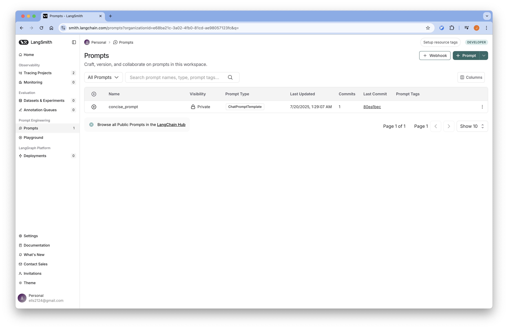
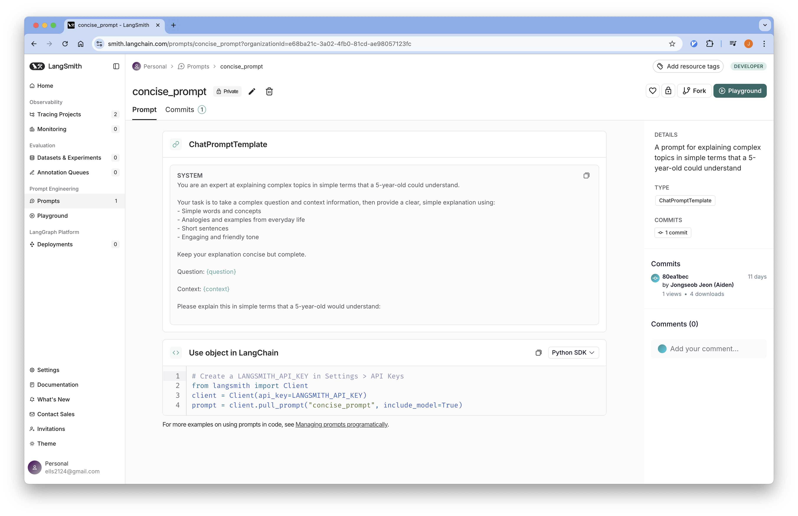

# LangSmith Prompt Registry

LangSmith를 사용하여 프롬프트를 버전 관리하고 등록하는 방법에 대해 설명합니다.

## 개요

LangSmith의 Prompt Registry 기능을 사용하여 프롬프트를 중앙에서 관리하고 버전을 추적할 수 있습니다. LangSmith는 LangChain에서 공식적으로 제공하는 개발자 플랫폼으로, 프롬프트 관리 기능도 제공합니다.

## Requirements

### 1. LangSmith 계정 설정

LangSmith 계정을 생성하여 API 키를 발급받아야 합니다.

:::info
  [LangSmith 설치 가이드](../installation/langsmith.md)를 참고해 LangSmith 계정을 설정합니다.
:::

### 2. 환경 변수 설정

프로젝트 루트에 `.env` 파일을 생성하고 필요한 환경 변수를 설정합니다.

```bash
# LANGSMITH
LANGCHAIN_TRACING_V2="true"
LANGSMITH_ENDPOINT="https://api.smith.langchain.com"
LANGSMITH_API_KEY="<redacted>"
LANGSMITH_PROJECT="my-llm-project"

# LLM
MODEL_NAME=gpt-3.5-turbo
OPENAI_API_KEY=your_openai_api_key
OPENAI_API_BASE=https://api.openai.com/v1

# TAVILY
TAVILY_API_KEY=your_tavily_api_key
```

## Code

### Environments

#### 1. 환경 변수 로드

실행을 위해 필요한 환경 변수를 불러옵니다.

```python
from dotenv import load_dotenv

# 환경 변수 로드
load_dotenv(dotenv_path=".env", override=True)
```

#### 2. LangSmith 설정

LangSmith 클라이언트를 초기화합니다.

```python
import os
from langsmith import Client

LANGSMITH_API_KEY = os.getenv("LANGSMITH_API_KEY")
client = Client(api_key=LANGSMITH_API_KEY)
```

#### 3. LLM 모델 설정

```python
import os
from langchain_openai import ChatOpenAI

# 환경 변수에서 설정 가져오기
model_name = os.environ["MODEL_NAME"]
openai_api_key = os.environ["OPENAI_API_KEY"]
openai_api_base = os.environ["OPENAI_API_BASE"]

# LLM 모델 초기화
llm = ChatOpenAI(
    model_name=model_name,
    openai_api_key=openai_api_key,
    openai_api_base=openai_api_base,
)
```

#### 4. Tavily 검색 도구

웹 검색을 위한 Tavily 도구를 설정합니다:

```python
from langchain_tavily import TavilySearch

# Tavily 검색 도구 설정 (최대 1개 결과)
web_search_tool = TavilySearch(max_results=1)
```

:::info
  Tavily API 키는 <a href="../installation/tavily.md">tavily</a>를 참고해 발급 받을 수 있습니다.
:::

### Prompt Registry

#### 1. 프롬프트 템플릿 정의

RAG(Retrieval-Augmented Generation) 애플리케이션을 위한 프롬프트를 정의합니다:

```python
# Define the prompt template
plain_prompt_template = """
You are an expert at explaining complex topics in simple terms that a 5-year-old could understand. 

Your task is to take a complex question and context information, then provide a clear, simple explanation using:
- Simple words and concepts
- Analogies and examples from everyday life
- Short sentences
- Engaging and friendly tone

Keep your explanation concise but complete.

Question: {question}

Context: {context}

Please explain this in simple terms that a 5-year-old would understand:
"""
```

#### 2. LangChain 프롬프트 템플릿 생성

```python
from langchain_core.prompts import ChatPromptTemplate

# Define the prompt template
langsmith_prompt_template = ChatPromptTemplate.from_messages(
    [
        (
            "system",
            """You are an expert at explaining complex topics in simple terms that a 5-year-old could understand. 

Your task is to take a complex question and context information, then provide a clear, simple explanation using:
- Simple words and concepts
- Analogies and examples from everyday life
- Short sentences
- Engaging and friendly tone

Keep your explanation concise but complete.

Question: {question}

Context: {context}

Please explain this in simple terms that a 5-year-old would understand:
""",
        )
    ]
)
```

#### 3. LangSmith에 프롬프트 등록
LangSmith 에서는 prompt 를 github 과 같이 해시태그로 관리합니다.
이를 Github 과 연동해서 같이 관리할 수 있습니다.

:::warning
LangSmith는 프롬프트의 변경(diff)을 관리하기 때문에, 변경사항이 없을 경우 다음과 같은 에러가 발생하며 push되지 않습니다.
```json
{"detail":"Nothing to commit: prompt has not changed since latest commit"}
```
:::

```python
try:
    client.push_prompt(
        "concise_prompt",
        object=langsmith_prompt_template,
        description="A prompt for explaining complex topics in simple terms that a 5-year-old could understand",
    )
except Exception as e:
    print(e)
```

#### 4. LangSmith에서 프롬프트 로드

다음과 같이 해시태그를 명시해서 불러올 수 있습니다.
- ```{PROMPT_NAME}:{HASH_TAG}```

예를 들어서 제가 생성한 프롬프트는 다음과 같이 불러올 수 있습니다.
- ```concise_prompt:concise_prompt```

만약 명시하지 않은 경우 가장 최신의 commit 을 불러옵니다.

```python
langchain_prompt = client.pull_prompt("concise_prompt", include_model=True)
```

## LangSmith UI에서 Prompt 확인

1. 브라우저에서 [LangSmith](https://smith.langchain.com/)에 접속합니다.
2. 로그인 후 프로젝트를 선택합니다.
3. 왼쪽 사이드바에서 "Prompts" 탭을 클릭합니다.
4. 등록된 프롬프트 목록을 확인할 수 있습니다.
    
5. 각 프롬프트의 버전과 메타데이터를 확인할 수 있습니다.
    

## Prompt Test
불러온 프롬프트가 정상적으로 수행되는 지 확인합니다.

### LangGraph 애플리케이션 구성

#### Graph State

```python
from langchain.schema import Document
from typing import List
from typing_extensions import TypedDict

class GraphState(TypedDict):
    """
    그래프의 상태를 나타냅니다.
    """
    question: str
    documents: List[str]
    messages: List[str]
```

#### Search Node

```python
from langchain_core.messages import HumanMessage

def search(state):
    """
    질문을 기반으로 웹 검색을 수행합니다.

    Args:
        state (dict): 현재 그래프 상태

    Returns:
        state (dict): 웹 검색 결과가 추가된 documents 키로 업데이트된 상태
    """
    question = state["question"]
    documents = state.get("documents", [])

    # 웹 검색 수행
    web_docs = web_search_tool.invoke({"query": question})
    web_results = "\n".join([d["content"] for d in web_docs["results"]])
    web_results = Document(page_content=web_results)
    documents.append(web_results)

    return {"documents": documents, "question": question}
```

#### Explain Node

```python
def explain(state: GraphState):
    """
    컨텍스트를 기반으로 응답을 생성합니다.
    
    Args:
        state (dict): 현재 그래프 상태
        
    Returns:
        state (dict): LLM 생성 결과가 포함된 messages 키가 추가된 상태
    """
    question = state["question"]
    documents = state.get("documents", [])

    formatted = langchain_prompt.format(
        question=question, context="\n".join([d.page_content for d in documents])
    )
    generation = llm.invoke([HumanMessage(content=formatted)])
    return {"question": question, "messages": [generation]}
```

#### Compile Graph

```python
from langgraph.graph import StateGraph, START, END

# 상태 그래프 생성
graph = StateGraph(GraphState)

# 노드 추가
graph.add_node("explain", explain)
graph.add_node("search", search)

# 엣지 추가
graph.add_edge(START, "search")
graph.add_edge("search", "explain")
graph.add_edge("explain", END)

# 그래프 컴파일
app = graph.compile()
```

#### (Optional) Visualize Graph

```python
from IPython.display import Image, display

display(Image(app.get_graph().draw_mermaid_png()))
```

### Graph Test

```python
# 질문 정의
question = "What is complexity economics?"

# 애플리케이션 실행
response = app.invoke({"question": question})

# 응답 출력
print(response["messages"][0].content)
```
