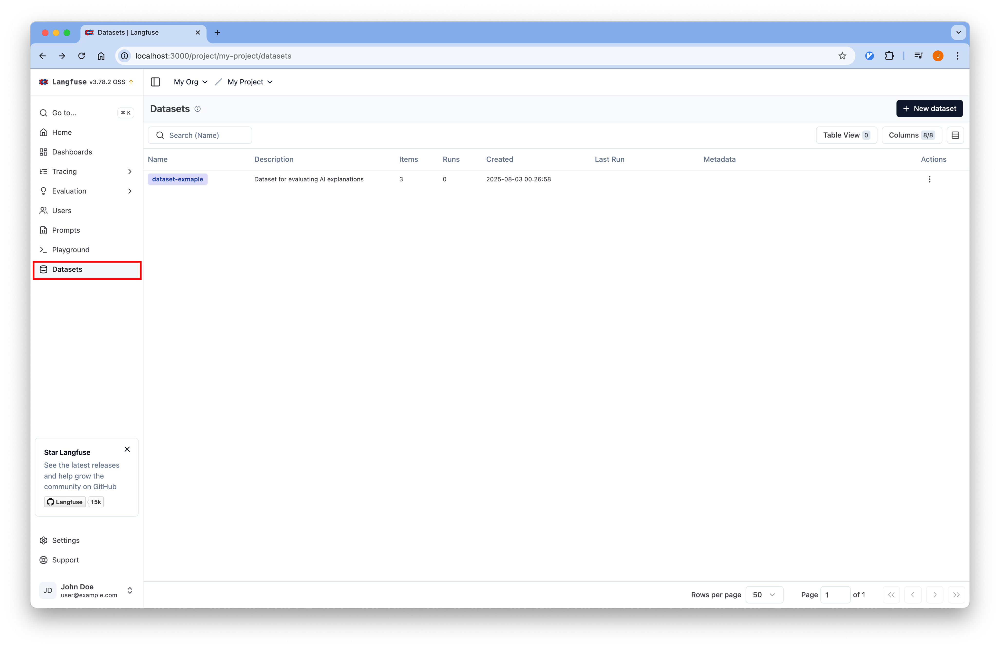
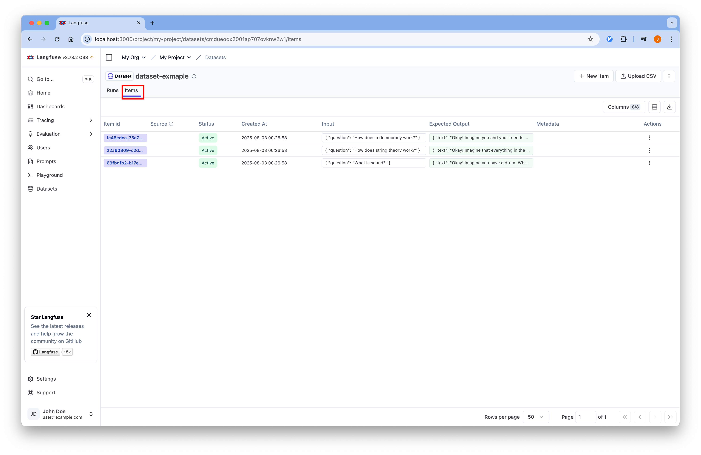

# 03-Dataset

## 개요
Self-hosted Langfuse를 사용하여 LangChain 애플리케이션의 데이터셋을 관리하고 평가할 수 있습니다.

튜토리얼에서 사용하는 코드는
[Github](https://github.com/Aiden-Jeon/llm-monitoring/blob/main/notebooks/self_hosting_langfuse/03_dataset.ipynb)
에서 확인할 수 있습니다.

## Requirements

### 환경 변수 설정

프로젝트 루트에 `.env` 파일을 생성하고 필요한 환경 변수를 설정합니다.
:::info
[환경 변수 설정](../tracing/#Environments) 을 참조해 설정합니다.
:::

## Code

### Environments

#### 환경 변수 로드

실행을 위해 필요한 환경 변수를 불러옵니다.

```python
from dotenv import load_dotenv

# 환경 변수 로드
load_dotenv(dotenv_path=".env", override=True)
```

### Langfuse 설정

Langfuse 클라이언트를 초기화하고 연결을 확인합니다.

```python
from langfuse import get_client
from langfuse.langchain import CallbackHandler

langfuse = get_client()
langfuse_handler = CallbackHandler()

# 연결 확인
if langfuse.auth_check():
    print("Langfuse client is authenticated and ready!")
else:
    print("Authentication failed. Please check your credentials and host.")
```

### Dataset 생성 및 관리

#### 1. Dataset 생성

Langfuse를 사용하여 데이터셋을 생성합니다.

```python
dataset_name = "dataset-exmaple"
try:
    # Try to read the dataset first to see if it already exists
    dataset = langfuse.get_dataset(name=dataset_name)
except:
    # Dataset doesn't exist, create it
    dataset = langfuse.create_dataset(
        name=dataset_name,
        description="Dataset for evaluating AI explanations",
    )
```

### Dataset에 레코드 추가

#### 1. 레코드 데이터 준비

평가용 데이터를 준비합니다.

```python
records = [
    {
        "input_question": "What is sound?",
        "output_output": "Okay! Imagine you have a drum. When you hit it, the drum shakes, right? That shaking is called a vibration. Now, when the drum shakes, it makes the air around it wiggle too, almost like when you throw a rock in a pond and the water makes little waves. These wiggles in the air are what we call sound! So, sound is like little invisible wiggles in the air that our ears can feel and hear. Just like how you can hear your friend calling you or your favorite song, those are sounds!",
    },
    {
        "input_question": "How does string theory work?",
        "output_output": "Okay! Imagine that everything in the universe, like stars, trees, and even you, is made of tiny building blocks, kind of like LEGO bricks. Now, in string theory, instead of those building blocks being tiny dots, they are super tiny strings, like the strings on a guitar! These strings can wiggle and vibrate. Picture a guitar playing different notes – when a string vibrates in different ways, it makes different sounds. In the same way, when these tiny strings vibrate differently, they become different things, like particles that make up everything you see around you. So, when the strings wiggle and dance around in space, they interact with each other – sometimes they might hug and combine, and other times they might bounce off each other, just like friends playing together. When we look closely at these strings, they act like the little particles we learn about in science. In short, string theory is like saying that everything is made of tiny, wiggly strings, and how they dance and vibrate tells us all about the world we live in!",
    },
    {
        "input_question": "How does a democracy work?",
        "output_output": "Okay! Imagine you and your friends want to decide what game to play. Instead of just one person deciding, everyone gets a turn to say what they want. In a democracy, it's like that, but for the whole country! Here's how it works: 1. **Everyone Has a Voice**: Just like you and your friends all get to say what game you want, in a democracy, everyone gets to share their opinions. This means that everyone gets to vote on important things. 2. **Voting**: When it's time to make a decision, like picking a leader or a new law, everyone votes. Voting is like marking your favorite game on a piece of paper. The choice with the most votes wins! 3. **Leaders**: The people who get the most votes (like class leaders) are called leaders too! They help make the rules and decisions for everyone. 4. **Fairness**: Everyone is treated equally, so whether you're big or small, everyone's voice is important! 5. **Change is Possible**: If people don't like something, they can vote again later or even choose new leaders. It's like changing the game if everyone wants to play something different. So, in a democracy, people work together to decide what's best for everyone by talking, voting, and making sure everyone can be heard!",
    },
]
```

#### 2. Dataset에 레코드 추가

```python
for record in records:
    langfuse.create_dataset_item(
        dataset_name=dataset_name,
        # any python object or value, optional
        input={"question": record["input_question"]},
        # any python object or value, optional
        expected_output={"text": record["output_output"]},
    )
```

### Dataset 확인

```python
dataset = langfuse.get_dataset(name=dataset_name)

# Access dataset properties
print(f"Dataset ID: {dataset.id}")

for item in dataset.items:
    print("input:", item.input)
    print("expected_output:", item.expected_output)
```

## Langfuse UI에서 Dataset 확인

1. Langfuse 웹 인터페이스에 접속합니다.
2. 왼쪽 사이드바에서 "Datasets" 탭을 클릭합니다.
    
3. 생성한 데이터셋을 선택하면 업로드된 데이터셋을 확인할 수 있습니다.
    
