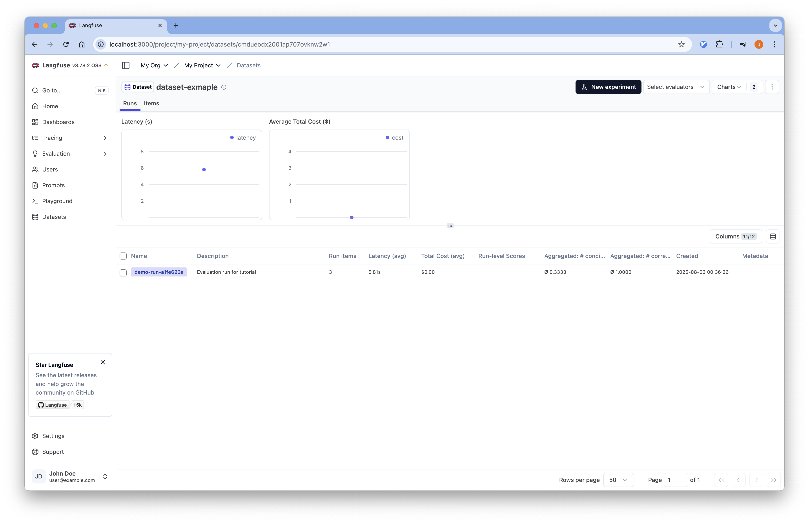
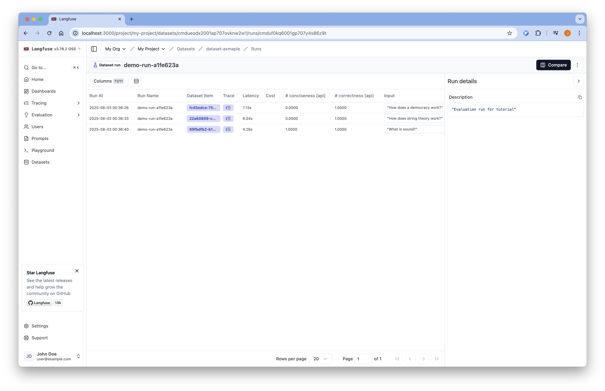

# 04-Evaluation

## 개요
Self-hosted Langfuse를 사용하여 LangChain 애플리케이션의 성능을 평가할 수 있습니다.

튜토리얼에서 사용하는 코드는
[Github](https://github.com/Aiden-Jeon/llm-monitoring/blob/main/notebooks/self_hosting_langfuse/04_experiment.ipynb)
에서 확인할 수 있습니다.

## Requirements

1. Langfuse 서버가 실행 중이어야 합니다.
    :::info
    [Langfuse 설치](../installation/) 를 참조해 서버를 실행합니다.
    :::

2. 프로젝트 루트에 `.env` 파일을 생성하고 필요한 환경 변수를 설정합니다.
    :::info
    [환경 변수 설정](../tracing/#Environments) 을 참조해 설정합니다.
    :::

## Code

### Environments

실행을 위해 필요한 환경 변수를 불러옵니다.

```python
from dotenv import load_dotenv

# 환경 변수 로드
load_dotenv(dotenv_path=".env", override=True)
```

### Setup

#### Langfuse

Langfuse 클라이언트를 설정합니다.

```python
from langfuse import get_client
from langfuse.langchain import CallbackHandler

langfuse = get_client()
langfuse_handler = CallbackHandler()

# 연결 확인
if langfuse.auth_check():
    print("Langfuse client is authenticated and ready!")
else:
    print("Authentication failed. Please check your credentials and host.")
```

#### LLM

LLM 모델을 설정합니다.

```python
import os
from langchain_openai import ChatOpenAI

# 환경 변수에서 설정 가져오기
model_name = os.environ["MODEL_NAME"]
openai_api_key = os.environ["OPENAI_API_KEY"]
openai_api_base = os.environ["OPENAI_API_BASE"]

# LLM 모델 초기화
llm = ChatOpenAI(
    model_name=model_name,
    openai_api_key=openai_api_key,
    openai_api_base=openai_api_base,
)
```

#### Tavily

웹 검색을 위한 Tavily 도구를 설정합니다.

```python
from langchain_tavily import TavilySearch

# Tavily 검색 도구 설정 (최대 1개 결과)
web_search_tool = TavilySearch(max_results=1)
```

### Define App Workflow

앞선 tracing 에서 사용한 app 을 정의합니다.

```python
import os
from typing import List
from typing_extensions import TypedDict

from langchain.schema import Document
from langgraph.graph import StateGraph, START, END
from langchain_core.messages import HumanMessage
from langchain_openai import ChatOpenAI
from langchain_tavily import TavilySearch


# 환경 변수에서 설정 가져오기
model_name = os.environ["MODEL_NAME"]
openai_api_key = os.environ["OPENAI_API_KEY"]
openai_api_base = os.environ["OPENAI_API_BASE"]

# LLM 모델 초기화
llm = ChatOpenAI(
    model_name=model_name,
    openai_api_key=openai_api_key,
    openai_api_base=openai_api_base,
)

# Tavily 검색 도구 설정 (최대 1개 결과)
web_search_tool = TavilySearch(max_results=1)

prompt = """You are a professor and expert in explaining complex topics in a way that is easy to understand. 
Your job is to answer the provided question so that even a 5 year old can understand it. 
You have provided with relevant background context to answer the question.

Question: {question} 

Context: {context}

Answer:"""


class GraphState(TypedDict):
    """
    그래프의 상태를 나타냅니다.
    """

    question: str
    documents: List[str]
    messages: List[str]


def search(state):
    """
    질문을 기반으로 웹 검색을 수행합니다.

    Args:
        state (dict): 현재 그래프 상태

    Returns:
        state (dict): 웹 검색 결과가 추가된 documents 키로 업데이트된 상태
    """
    question = state["question"]
    documents = state.get("documents", [])

    # 웹 검색 수행
    web_docs = web_search_tool.invoke({"query": question})
    web_results = "\n".join([d["content"] for d in web_docs["results"]])
    web_results = Document(page_content=web_results)
    documents.append(web_results)

    return {"documents": documents, "question": question}


def explain(state: GraphState):
    """
    컨텍스트를 기반으로 응답을 생성합니다.

    Args:
        state (dict): 현재 그래프 상태

    Returns:
        state (dict): LLM 생성 결과가 포함된 messages 키가 추가된 상태
    """
    question = state["question"]
    documents = state.get("documents", [])
    formatted = prompt.format(
        question=question, context="\n".join([d.page_content for d in documents])
    )
    generation = llm.invoke([HumanMessage(content=formatted)])
    return {"question": question, "messages": [generation]}


# 상태 그래프 생성
graph = StateGraph(GraphState)

# 노드 추가
graph.add_node("explain", explain)
graph.add_node("search", search)

# 엣지 추가
graph.add_edge(START, "search")
graph.add_edge("search", "explain")
graph.add_edge("explain", END)

# 그래프 컴파일
app = graph.compile()
```

### Evaluators 정의

#### 코드 기반 스코어러

결정적이거나 폐쇄형 메트릭을 측정하기 위한 코드 기반 스코어러를 정의합니다.

```python
def conciseness(outputs) -> bool:
    words = outputs.split(" ")
    return len(words) <= 200
```

이 특정 커스텀 코드 평가자는 애플리케이션이 200단어 이하의 출력을 생성하는지 확인하는 간단한 Python 함수입니다.

#### LLM-as-a-Judge 평가자

개방형 메트릭의 경우, LLM을 사용하여 출력을 평가하는 것이 강력할 수 있습니다.

```python
from pydantic import BaseModel, Field
from langchain_openai import ChatOpenAI
from langchain_core.messages import HumanMessage


# Define a scoring schema that our LLM must adhere to
class CorrectnessScore(BaseModel):
    """Correctness score of the answer when compared to the reference answer."""

    score: int = Field(
        description="The score of the correctness of the answer, from 0 to 1"
    )


def correctness(question, output, reference_output) -> bool:
    prompt = """
    You are an expert data labeler evaluating model outputs for correctness. Your task is to assign a score based on the following rubric:

    <Rubric>
        A correct answer:
        - Provides accurate information
        - Uses suitable analogies and examples
        - Contains no factual errors
        - Is logically consistent

        When scoring, you should penalize:
        - Factual errors
        - Incoherent analogies and examples
        - Logical inconsistencies
    </Rubric>

    <Instructions>
        - Carefully read the input and output
        - Use the reference output to determine if the model output contains errors
        - Focus whether the model output uses accurate analogies and is logically consistent
    </Instructions>

    <Reminder>
        The analogies in the output do not need to match the reference output exactly. Focus on logical consistency.
    </Reminder>

    <input>
        {}
    </input>

    <output>
        {}
    </output>

    Use the reference outputs below to help you evaluate the correctness of the response:
    <reference_outputs>
        {}
    </reference_outputs>
    """.format(
        question, output, reference_output
    )

    structured_llm = ChatOpenAI(
        model_name=model_name,
        openai_api_key=openai_api_key,
        openai_api_base=openai_api_base,
        temperature=0
    ).with_structured_output(CorrectnessScore)
    generation = structured_llm.invoke([HumanMessage(content=prompt)])
    return generation.score == 1
```

### Evaluation

#### 1. 평가 데이터셋 정의

기존 데이터셋을 로드합니다.

```python
# Step 1: Define evaluation dataset
dataset_name = "dataset-exmaple"
dataset = langfuse.get_dataset(name=dataset_name)
```

#### 2. 예측 함수 정의

평가 데이터셋의 모든 행에 대해 호출될 예측 함수를 정의합니다.

```python
# Step 2: Define run
# Assume 'run' is your instrumented application function
def run(question):
    with langfuse.start_as_current_generation(name="qna-llm-call") as generation:
        # LLM call
        response = app.invoke({"question": question})
        output = response["messages"][0].content
        # Update the trace with the input and output
        generation.update_trace(
            input=question,
            output=output,
        )
        return output
```

#### 3. 평가 실행

평가를 실행합니다.

```python
from uuid import uuid4

suffix = str(uuid4())[:8]
current_run_name = f"demo-run-{suffix}"  # Identifies this specific evaluation run


for item in dataset.items:
    # Use the item.run() context manager
    with item.run(
        run_name=current_run_name, run_description="Evaluation run for tutorial"
    ) as root_span:  # root_span is the root span of the new trace for this item and run.
        # All subsequent langfuse operations within this block are part of this trace.

        # Call your application logic
        question = item.input["question"]
        generated_answer = run(question=question)

        # metrics
        conciseness_score = conciseness(generated_answer)
        root_span.score(
            name="conciseness",
            value=conciseness_score,
            data_type="NUMERIC",
        )

        correctness_score = correctness(
            question=question,
            output=generated_answer,
            reference_output=item.expected_output["text"],
        )
        root_span.score(
            name="correctness",
            value=correctness_score,
            data_type="NUMERIC",
        )
```

## Langfuse UI에서 Evaluation 확인

1. Langfuse 서버에 접속합니다.
2. 왼쪽 사이드바에서 "Datasets" 탭을 클릭합니다.
3. 생성한 dataset에 들어가서 평가 결과를 확인할 수 있습니다.
    
4. 각 run을 클릭하면 상세 내용을 확인할 수 있습니다.
    
