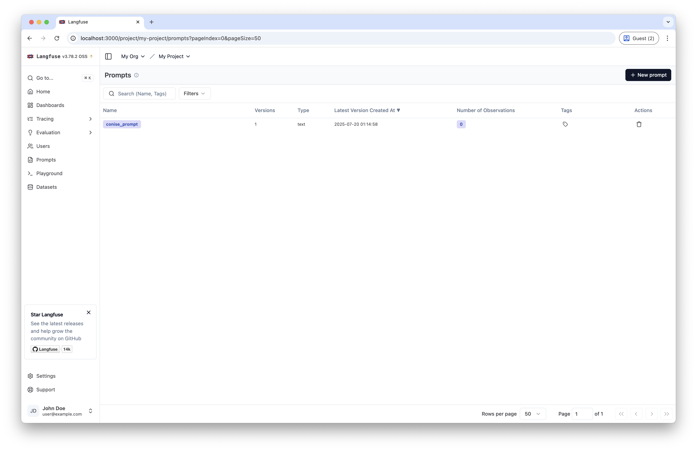
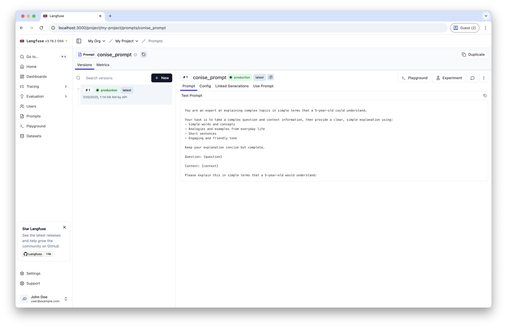

# 03-Prompt Registry

Self-hosting 환경에서 Langfuse를 사용하여 프롬프트를 버전 관리하고 등록하는 방법에 대해 설명합니다.

## 개요

Langfuse의 Prompt Registry 기능을 사용하여 프롬프트를 중앙에서 관리하고 버전을 추적할 수 있습니다. Langfuse는 LLM 애플리케이션을 위한 오픈소스 관찰성 플랫폼으로, 프롬프트 관리 기능도 제공합니다.

## Requirements

### 1. Langfuse 서버 실행

Self-hosting 환경에서 Langfuse 서버를 실행해야 합니다.

:::info
  [Self-Hosting Langfuse 설치 가이드](../installation/index.md)를 참고해 Langfuse 서버를 실행합니다.
:::

### 2. 환경 변수 설정

프로젝트 루트에 `.env` 파일을 생성하고 필요한 환경 변수를 설정합니다.

```bash
# LANGFUSE
LANGFUSE_SECRET_KEY=lf_sk_1234567890
LANGFUSE_PUBLIC_KEY=lf_pk_1234567890
LANGFUSE_HOST="http://localhost:3000"

# LLM
MODEL_NAME=gpt-3.5-turbo
OPENAI_API_KEY=your_openai_api_key
OPENAI_API_BASE=https://api.openai.com/v1

# TAVILY
TAVILY_API_KEY=your_tavily_api_key
```

## Code

### Environments

#### 1. 환경 변수 로드

실행을 위해 필요한 환경 변수를 불러옵니다.

```python
from dotenv import load_dotenv

# 환경 변수 로드
load_dotenv(dotenv_path=".env", override=True)
```

#### 2. Langfuse 설정

Langfuse 클라이언트를 초기화하고 연결을 확인합니다.

```python
from langfuse import get_client
from langfuse.langchain import CallbackHandler

langfuse = get_client()
langfuse_handler = CallbackHandler()

# 연결 확인
if langfuse.auth_check():
    print("Langfuse client is authenticated and ready!")
else:
    print("Authentication failed. Please check your credentials and host.")
```

#### 3. LLM 모델 설정

```python
import os
from langchain_openai import ChatOpenAI

# 환경 변수에서 설정 가져오기
model_name = os.environ["MODEL_NAME"]
openai_api_key = os.environ["OPENAI_API_KEY"]
openai_api_base = os.environ["OPENAI_API_BASE"]

# LLM 모델 초기화
llm = ChatOpenAI(
    model_name=model_name,
    openai_api_key=openai_api_key,
    openai_api_base=openai_api_base,
)
```

#### 4. Tavily 검색 도구

웹 검색을 위한 Tavily 도구를 설정합니다:

```python
from langchain_tavily import TavilySearch

# Tavily 검색 도구 설정 (최대 1개 결과)
web_search_tool = TavilySearch(max_results=1)
```

:::info
  Tavily API 키는 [Tavily Key 발급](../../prerequisitres/tavily/index.md)를 참고해 발급 받을 수 있습니다.
:::
### Prompt Registry

#### 1. 프롬프트 템플릿 정의

RAG(Retrieval-Augmented Generation) 애플리케이션을 위한 프롬프트를 정의합니다:

```python
# Define the prompt template
plain_prompt_template = """
You are an expert at explaining complex topics in simple terms that a 5-year-old could understand. 

Your task is to take a complex question and context information, then provide a clear, simple explanation using:
- Simple words and concepts
- Analogies and examples from everyday life
- Short sentences
- Engaging and friendly tone

Keep your explanation concise but complete.

Question: {question}

Context: {context}

Please explain this in simple terms that a 5-year-old would understand:
"""
```

#### 2. Langfuse에 프롬프트 등록

```python
# Create a chat prompt
langfuse.create_prompt(
    name="conise_prompt",
    prompt=plain_prompt_template,
    labels=["production"],
)
```

#### 3. Langfuse에서 프롬프트 로드

Langfuse 에서 prompt 를 불러올 때는 version 혹은 label 를 사용해 불러옵니다.
default 값은 production 으로 등록된 프롬프트를 불러옵니다.
```python
from langchain_core.prompts import ChatPromptTemplate

# Get production prompt
langfuse_prompt = langfuse.get_prompt("conise_prompt")
langchain_prompt = ChatPromptTemplate.from_template(
        langfuse_prompt.get_langchain_prompt(),
        metadata={"langfuse_prompt": langfuse_prompt},
    )
```
## Langfuse UI에서 Prompt 확인

1. 브라우저에서 `http://localhost:3000`에 접속합니다.
2. 로그인 후 프로젝트를 선택합니다.
3. 왼쪽 사이드바에서 "Prompts" 탭을 클릭합니다.
4. 등록된 프롬프트 목록을 확인할 수 있습니다.
    
5. 각 프롬프트의 버전과 라벨을 확인할 수 있습니다.
    

## Prompt Test
불러온 프롬프트가 정상적으로 수행되는 지 확인합니다.

### LangGraph 애플리케이션 구성

#### Graph State

```python
from langchain.schema import Document
from typing import List
from typing_extensions import TypedDict

class GraphState(TypedDict):
    """
    그래프의 상태를 나타냅니다.
    """
    question: str
    documents: List[str]
    messages: List[str]
```

#### Search Node

```python
from langchain_core.messages import HumanMessage

def search(state):
    """
    질문을 기반으로 웹 검색을 수행합니다.

    Args:
        state (dict): 현재 그래프 상태

    Returns:
        state (dict): 웹 검색 결과가 추가된 documents 키로 업데이트된 상태
    """
    question = state["question"]
    documents = state.get("documents", [])

    # 웹 검색 수행
    web_docs = web_search_tool.invoke({"query": question})
    web_results = "\n".join([d["content"] for d in web_docs["results"]])
    web_results = Document(page_content=web_results)
    documents.append(web_results)

    return {"documents": documents, "question": question}
```

#### Explain Node

```python
def explain(state: GraphState):
    """
    컨텍스트를 기반으로 응답을 생성합니다.
    
    Args:
        state (dict): 현재 그래프 상태
        
    Returns:
        state (dict): LLM 생성 결과가 포함된 messages 키가 추가된 상태
    """
    question = state["question"]
    documents = state.get("documents", [])
    formatted = langchain_prompt.format(
        question=question, context="\n".join([d.page_content for d in documents])
    )
    generation = llm.invoke([HumanMessage(content=formatted)])
    return {"question": question, "messages": [generation]}
```

#### Compile Graph

```python
from langgraph.graph import StateGraph, START, END

# 상태 그래프 생성
graph = StateGraph(GraphState)

# 노드 추가
graph.add_node("explain", explain)
graph.add_node("search", search)

# 엣지 추가
graph.add_edge(START, "search")
graph.add_edge("search", "explain")
graph.add_edge("explain", END)

# 그래프 컴파일
app = graph.compile()
```

#### (Optional) Visualize Graph

```python
from IPython.display import Image, display

display(Image(app.get_graph().draw_mermaid_png()))
```

### Graph Test

```python
question = "What is complexity economics?"

# 애플리케이션 실행 (Langfuse 핸들러 포함)
response = app.invoke(
    {"question": question}, 
    config={"callbacks": [langfuse_handler]}
)

# 응답 출력
print(response["messages"][0].content)
```

